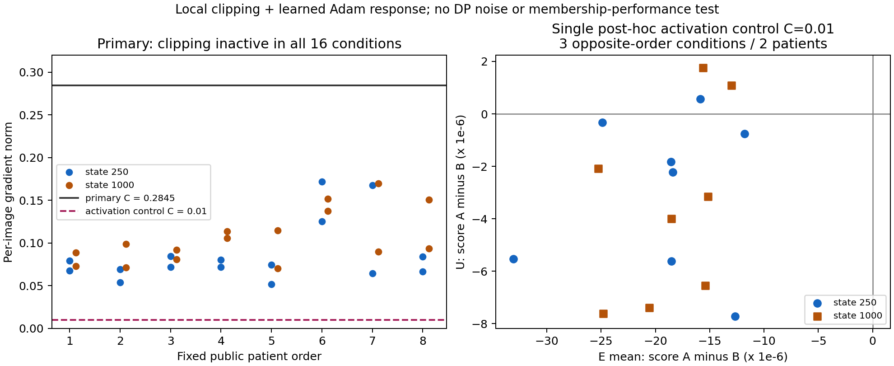

# 클리핑·Adam·E/U 반응의 최소 검증 결과

2026-09-15. [후보를 좁힌 근거](PROTECTION_OBSERVATION_CLAIM_20260915.md)와 [전체 연구 목표](PAPER_LEVEL_REDESIGN_20260915.md)를 이어 수행했다. **전체 위치는 2번의 후보 검토이며, 이번 국소 검증 완료가 논문 설계 전체의 검증 완료를 뜻하지 않는다.**

## 결론과 의미

**원래 공개 문턱값에서는 차이가 없었다. 클리핑이 작동하도록 한 단일 대조에서는 실제 의료 입력과 학습된 Adam 상태에서도 E/U의 A/B loss 순서가 달라지는 사례가 관측됐다.**

- 원래 C=0.284487: 8명 × 두 상태의 16조건 모두 클리핑이 비활성이어서 A/B 업데이트·E/U loss 차이가 정확히 0이었다.
- 추가 C=0.01: 16조건 중 3조건, 서로 다른 환자로는 2명에서 E와 U의 A/B loss 순서가 반대였다. 한 환자는 두 상태 모두, 다른 환자는 1000-step 상태에서 관측됐다.
- 따라서 수학적 예시에서 제안한 **조건부 현상이 실제 모델에서도 나타날 수 있다는 근거**는 얻었다. 현재 운용 문턱값의 보호 효과, DP 학습의 보호 순위, 강한 MIA의 판별력이나 CVPR 기여는 입증하지 않았다.

이 결과는 다음 설계의 우선순위를 좁힌다. 추가로 점수를 튜닝하기보다 **왜 논문에서 비교할 실제 보호 설정에 활성 클리핑이 생기는지, 그 설정이 유효 환자 보장·효용·비용 측면에서 왜 타당한지**를 먼저 연결해야 한다. 작은 C에서 원하는 현상이 보였다는 이유만으로 그 C를 실용적인 보호 설정으로 선택해서는 안 된다. 기존 C는 다른 초기 모델 상태와 timestep 추출 조건에서 정해졌으며, 이번 t500·학습된 상태 전체의 clipping 비율을 보장하지 않는다.



[전체 16조건 CSV](spec_sources/clipping_observation_local_20260915/all_conditions.csv) · [분석 JSON](spec_sources/clipping_observation_local_20260915/analysis.json) · [SVG](spec_sources/clipping_observation_local_20260915/local_results.svg)

## 무엇을 고정해서 비교했는가

| 항목 | 실제 실행 |
|---|---|
| 자료 | 사전에 hash로 정한 공개 개발 환자 8명, 환자당 3장. 기존 CVPR train·auxiliary·evaluation에 등장하는 모든 환자를 제외 |
| E/U 의미 | 이번 국소 업데이트에 제공한 E 2장, 제공하지 않은 같은 환자의 U 1장. 기존1000-step 학습의 membership 성능 실험과 구별 |
| 출발 모델 | 기존 비DP SD2.1 LoRA model_1의 step250·1000, 실제 adapter와 Adam moment·step·param_groups 복원 |
| 연산 A | 두 E의 gradient를 각각 C로 clip한 뒤 평균 |
| 연산 B | 두 E의 gradient를 평균한 뒤 C로 clip |
| 분기 | 모든 환자·A/B마다 동일한 원래 파라미터와 optimizer 상태로 복원. 다음 환자로 업데이트를 누적하지 않음 |
| 입력 | P256 전처리·VAE posterior mode, generic prompt, t=500, 이미지별 hash seed의 diffusion noise 한 번을 모든 분기와 상태에서 재사용 |
| 정밀도 | 원 FP16 base 가중치 값을 FP32로 승격, FP32 forward/backward·LoRA·Adam. 원래 weak-label/AMP 학습의 수치 재현은 아님 |
| 보호 범위 | DP gradient noise=0, 공개 outer 분모=1, 다른 환자 배경 기여 없음. 원형 ELS/ULS 전체 또는 DP 학습 결과가 아님 |
| 주 관측 | score_A−score_B = loss_B−loss_A. 실제 θ_A−θ_B와 query gradient의 내적을 함께 비교 |

과거 momentum 때문에 두 분기가 공통으로 바뀔 수 있으므로 baseline 대비 개선을 그대로 clipping 효과로 세지 않았다. 주 비교는 같은 출발점의 A/B 직접 차이다. 같은 환자라는 사실로 gradient의 공통 성분이나 정렬을 가정하지 않았다.

## 첫 실행: 후보가 발동하는 조건이 없었다

원래 C=0.28448700606156724는 기존 공개 calibration의 선정 image p80이다. 이번 두 상태에서 E gradient norm의 전체 범위는 0.0516939–0.1718270이었다. 모든 E gradient와 환자 평균 gradient가 C보다 작았다.

따라서 A=B라는 대수적 예측에 맞게 16조건 모두 실제 Adam 파라미터와 E/U loss 차이가 0이었다. **Adam이 방향 차이를 지웠다는 결과가 아니다. 입력 단계부터 연산 차이가 없었다.** 이 첫 실행만으로 활성 클리핑의 효과를 판단할 수는 없었다.

[첫 실행 계약](../../code_working/_reports/cvpr_u_pilot_v1_001/protection_observation_20260915/clipping_observation_local_v1/protocol.json) · [결과](../../code_working/_reports/cvpr_u_pilot_v1_001/protection_observation_20260915/clipping_observation_local_v1/results.json)

## 추가한 대조와 그 경위

첫 실행이 모두 비활성임을 확인한 뒤, 사용자에게 추가 이유·범위·예상 시간을 알리고 **기존 공개 calibration grid의 최솟값 C=0.01 하나**로 활성 대조를 수행했다. 이번 대조의 착수는 사후 결정이며 첫 실행의 사전 조건으로 소급하지 않는다. 여러 C를 실행해 E/U 부호가 원하는 값을 선택한 것이 아니며, 이번 작은 C의 의료 효용이나 운용 타당성이 입증된 것도 아니다.

모델·환자·gradient·prompt·noise·timestep·Adam 상태는 그대로 재사용했다. gradient 재계산이나 추가 장기 학습은 하지 않았다. 첫 결과·계약·코드는 보존하고 별도 실행 폴더에 기록했다.

아래 score는 **음의 원시 denoising MSE**다. 음수 차이는 B의 score가 더 크다는 뜻이고, 양수 차이는 A의 score가 더 크다는 뜻이다. score의 크기를 프라이버시 위험으로 직접 해석하지 않는다.

| 공개 fixture 환자 순서 | 모델 상태 | E 평균 score_A−score_B | U score_A−score_B | 관측 |
|---|---:|---:|---:|---|
| 1 | 250 | −1.58836e−5 | +5.62990e−7 | E/U 순서 반대 |
| 1 | 1000 | −1.29804e−5 | +1.08935e−6 | E/U 순서 반대 |
| 2 | 1000 | −1.55999e−5 | +1.76479e−6 | E/U 순서 반대 |
| 나머지 13조건 | 두 상태 | 모두 음수 | 모두 음수 | 이번 관측의 순서 동일 |

16조건은 16명의 독립 환자가 아니다. 두 체크포인트는 같은 모델의 학습 경로에 속한다. 또한 일부 반대 부호 사례에서 A/B 모두 U loss가 baseline보다 증가했다. “A는 U를 더 학습했다” 또는 “더 위험해졌다”라고 바꾸어 표현하지 않는다.

[활성 대조 계약](../../code_working/_reports/cvpr_u_pilot_v1_001/protection_observation_20260915/clipping_activation_control_v1/protocol.json) · [전체 결과](../../code_working/_reports/cvpr_u_pilot_v1_001/protection_observation_20260915/clipping_activation_control_v1/results.json)

## 설명한 1차 관계는 얼마나 맞았는가

실제 저장된 FP32 파라미터의 차이로 다음 값을 계산했다.

```text
실측: score_A − score_B
예측: −gradient(query) · (theta_A − theta_B)
```

48개 영상×상태 관측 중 부호는 47개에서 일치했다. E 평균은 16/16, U는 15/16이었다. 모든 영상 차이를 묶은 상대 L2 오차는 약3.51%, 개별 상대오차의 중앙값은 약1.47%였다. 상대오차는 |실측−예측|/max(|실측|,|예측|)로 계산했다.

그러나 근사가 모두 정확하지는 않았다.

- 환자 순서7의 step250 U: 예측 +1.30e−8, 실측 −3.34e−7로 부호가 달랐다.
- 환자 순서3의 step1000 U: 같은 음수 부호였지만 크기 상대오차가 약52%였다.
- 처음 정한 환자 순서1의 두 상태에서 파라미터 변화량을 절반으로 줄인 대조도 저장했다. 해당 두 U의 반대 부호는 유지됐지만 이를 다른 환자·noise·학습 경로의 안정성으로 확대하지 않는다.

따라서 **실제 Adam 이후 변화와 loss 반응을 연결하는 국소 설명이 대체로 유용했다**고 볼 수 있다. 정확한 예측 정리, 모든 관측의 부호 보장, 또는 회전 성분만이 원인이라는 입증은 아니다. A/B의 크기·방향 차이와 Adam의 변환이 함께 들어간다.

## 무엇이 다음 연구에 남는가

| 질문 | 이번에 알게 된 범위 |
|---|---|
| 실제 의료 입력에서는 이 관계가 원천적으로 사라지는가? | 단일 활성 대조에서 사례가 관측돼, 지정 조건의 가능성을 확인했다. |
| 기존 실제 문턱값에서 곧바로 E/U 차이가 생기는가? | 이번 t500·두 상태·8명에서는 전혀 생기지 않았다. |
| 특정 보호 방식이 환자를 더 잘 보호하는가? | 비회원 대조·DP noise·학습 경로·공정한 공격 비교가 없어 판단하지 않았다. |
| 환자의 공통 특성이 원인인가? | 촬영 차이·이미지별 noise·일반적인 query 방향과 분리하지 않았다. |
| 새 공격법이 필요한가? | 이번 결과에서 그런 필요성은 도출되지 않는다. |
| 현재 CVPR 후보를 어떻게 좁히는가? | 활성 clipping의 실제 운용 조건과 관측 평가 사이의 연결을 검토할 조건부 후보로 유지한다. 추가 장기 학습은 자동으로 시작하지 않는다. |

가장 가까운 User Inference·FACE-AUDITOR·ELS/ULS·CDI의 점유 범위는 유지한다. U를 사용한다는 점, clipping을 한다는 점, 집합으로 점수를 합친다는 점이 새로워진 것은 아니다. 이번 결과는 그 위에서 보호 연산과 관측 조건의 상호작용을 더 검토할 자료다.

## 실행·검산과 기록

- 첫 실행: 166 logical image-forward /52 backward, 실행기49.137초.
- 단일 활성 대조: 114 logical image-forward /0 backward, 실행기27.847초.
- 합계: 280F/52B, 실행기 약77초. VAE24장 전처리는 첫 실행에 포함됐다. backward 내부 checkpoint 재계산의 FLOP는 logical F 횟수와 별개다.
- 국소 임시 optimizer step은 총68회이며, 장기 학습을 이어가거나 기존 checkpoint를 덮어쓰지 않았다.
- **독립 검산 PASS:** 각 실행의16조건에서 저장 raw tensor의 산술·source state·별도 CPU Adam 재계산·입력 결속을 대조했다. 첫 실행16.227초, 활성 대조17.002초였다. 검산기 SHA는31f862f1…9ceac이며 검산 실행 전에 고정했다. 이 PASS는 산술·출처 검산이지 가설 또는 프라이버시 성능의 합격 판정이 아니다.
- **출처 보강:** 실행 후 실제 cache hidden·checkpoint·snapshot·scheduler·C 출처를 별도27파일 해시로 대조했다. 이는 실행 전 계약이 아니라 실행 후 provenance 보강이다.

[첫 실행 검산](../../code_working/_reports/cvpr_u_pilot_v1_001/protection_observation_20260915/clipping_observation_local_v1/verification_v1/verification.json) · [활성 대조 검산](../../code_working/_reports/cvpr_u_pilot_v1_001/protection_observation_20260915/clipping_activation_control_v1/verification_v1/verification.json) · [출처 보강](../../code_working/_reports/cvpr_u_pilot_v1_001/protection_observation_20260915/provenance_supplement.json)

저장 산술 검산은 전체 신경망 backward를 독립 재현했다는 뜻이 아니다. FP64는 저장된 FP32 prediction의 MSE reduction과 내적 계산에 사용했다. 작은 국소 loss 차이를 low-FPR 성능이나 환자 위험의 실용적 변화량으로 환산하지 않는다.
