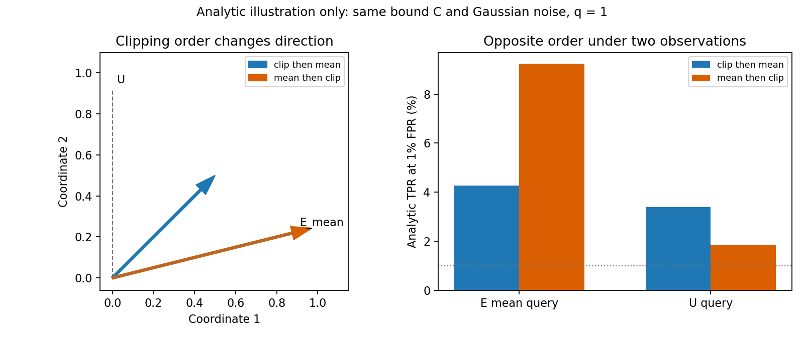

# 보호 방식과 E/U 평가의 연결: 구체적 후보와 검증 설계

**후속 최소 검증 완료:** [실제 결과·그림·검산과 의미](CLIPPING_OBSERVATION_LOCAL_RESULTS_20260915.md). 기존 C에서는16조건 모두 비활성으로 차이0이었다. 별도 사후 단일 C=.01 활성 대조에서는3조건/2환자의 E/U loss 순서가 반대였고 실제 Adam 변화의1차 예측은48개 중47개 부호가 일치했다. 조건부 국소 근거이며 DP 보호 순위·MIA 성능은 미검증이다. 아래의 “준비·미실행”은 후속 실행 전 작성 상태다.

2026-09-15. [전체 연구 구조](PAPER_LEVEL_REDESIGN_20260915.md)를 이어 2번에서 수행한 원문·수식·코드 대조 결과다. **다음에 검증할 후보를 “클리핑 순서가 바꾸는 학습 방향과 E/U 보호 비교의 적용 범위”로 좁힌다.** 이는 최종 논문 주제나 실제 의료 성능의 확정이 아니다.

## 1. 이번에 확보한 연결

사진별로 학습 영향을 제한한 뒤 평균내는 것과, 한 환자의 여러 사진을 평균낸 뒤 그 영향을 제한하는 것은 일반적으로 다른 연산이다. 사진별 gradient의 크기와 방향이 다르면 첫 연산은 사진마다 다른 가중치를 주지만, 두 번째 연산은 환자 평균 방향을 유지한 채 크기를 제한한다.

따라서 **어떤 사진으로 모델을 평가하는가에 따라 이 차이가 다르게 보일 수 있다.** 실제 학습 사진 E에서 더 강하게 나타나는 업데이트가 미학습 동일 환자 사진 U에서도 더 강하게 나타나리라는 결론은 자동으로 성립하지 않는다.

이 연결은 앞선 임의의 a/b 점수 예시보다 구체적이다. 기존 보호 연산의 수식과 기존 denoising-loss 공격 사이에 예측 가능한 관계를 놓을 수 있다. 다만 다음 세 범위를 엄격히 구분한다.

| 범위 | 현재 판단 |
|---|---|
| 같은 환자 sampler의 두 bounded-gradient 연산과 고정 선형 Gaussian 관측 | E/U 판별 순서가 달라질 수 있는 정확한 수학적 사례를 구성·계산했다. |
| 실제 diffusion의 국소 loss 반응 | 실제 파라미터 변화와 query gradient의 내적으로 1차 근사할 수 있다. 동일 환자라는 사실만으로 방향은 정해지지 않는다. |
| AdamW 전체 학습·강한 공격 적응·의료 보호 선택 | 아직 미검증이다. 이 단계의 우열을 수학적 사례에서 외삽하지 않는다. |

**이번 후보가 답할 논문 질문:** 같은 유효 환자 보장 아래, E에서 선택한 보호 방식이 U의 관측 위험에도 적합한 조건은 무엇이며, 어떤 학습·관측 구조에서 그 비교를 수정해야 하는가?

## 2. 원문에서 확인한 출발점과 이미 점유된 주장

[ELS/ULS 원문](https://arxiv.org/abs/2407.07737)의 Algorithms 1–2는 record별 clipping과 user 평균 clipping을 구분한다. 그러나 §3의 gradient-diversity 분석은 clipping을 no-op으로 두므로, 그 결과가 활성 clipping에 의한 선택적 신호 억제를 입증하는 것은 아니다. 원문의 전체 ELS/ULS는 sampling·기록 선택·분모·노이즈도 다르다. 이번 clipping 순서 대조를 원형 두 알고리즘의 전체 재현이라고 부르지 않는다. [로컬 pp.3–5](pdfs/B04.pdf#page=3)

더 넓은 주장은 이미 선행에 있다.

| 선행 | 이번에 제외한 단독 기여 주장 |
|---|---|
| User Inference, EMNLP2024 §4.4/Table2/App E.5–7 | 미학습 동일 사용자 자료로 공격한다; record-DP·중복 제거·클리핑 후에도 사용자 위험이 남는다; 평균 AUC와 저오탐 TPR가 다르게 변한다. |
| FACE-AUDITOR, USENIX2023 App C.2 | DP-SGD 학습 교란 뒤에도 미사용 동일인 영상 감사가 가능하다. |
| Hartmann, SaTML2023 §V/App B | 평가 조건이 특정 누출 경로를 제외한다; 일반화 개선이 누출 종류별로 다른 효과를 낼 수 있다. |
| ELS/ULS·Mind the Privacy Unit·tight group accounting | 사용자 평균·기록 선택·gradient diversity·환산 및 고정 연산량의 효용 비교를 제안한다. |

[User Inference 원문](https://aclanthology.org/2024.emnlp-main.1014.pdf), [FACE-AUDITOR 원문](https://www.usenix.org/system/files/usenixsecurity23-chen-min.pdf), [Hartmann 원문](https://arxiv.org/pdf/2209.08541), [페이지별 신규성 경계 노트](spec_sources/protection_unit_eu_novelty_audit_20260915.md).

따라서 “DP 뒤에도 U 공격이 된다”를 확인하는 실험만으로는 부족하다. **구체적인 보호 연산과 관측 조건의 상호작용이 실제 보호 선택에 주는 영향을 설명하고, 그 비교의 적용 범위를 개선하는 것**이 후보의 추가 몫이다. 관련 문헌 전체에서 미연구라고 확정한 것은 아니다.

## 3. 구체적인 연산과 차이가 생기는 조건

고정된 한 환자의 k개 영상 gradient를 g_j라 하자. 동일한 환자 sampling·공개 정규화 분모 아래 비교용 두 연산을 둔다.

- A: v_A = mean_j clip_C(g_j)
- B: v_B = clip_C(mean_j g_j)

이 A는 **patient-sampled 비교용 대조**다. record-Poisson sampling을 하는 원형 ELS가 아니다. 두 연산 모두 환자 하나의 기여 norm을 C 이하로 제한하므로, 같은 환자 add/remove 관계와 Gaussian noise scale에서 공통의 DP 상계로 비교할 수 있다. 이는 실현된 누출이 같다는 뜻은 아니다.

a_j = min(1, C/||g_j||), ā = mean_j a_j, ḡ = mean_j g_j, b = min(1, C/||ḡ||)라 하면,

```text
v_A = ā ḡ + c
c   = mean_j [(a_j − ā)(g_j − ḡ)]
v_B − v_A = (b − ā) ḡ − c
```

즉 단순한 평균 효과만 보는 것이 아니라 **사진별 clipping 계수와 gradient 방향의 결합 c**를 본다. c의 ḡ에 수직인 성분이 있으면 A는 평균 방향에서 벗어날 수 있다. 이 대수적 분해 자체를 새로운 정리라고 주장하지 않는다.

- 모든 clipping이 비활성이면 A=B다.
- 모든 a_j가 같으면 두 업데이트는 환자 평균 방향 위에 있다. 크기는 다를 수 있으며, 실제 전체 알고리즘의 sampling·noise 차이까지 없어지는 것은 아니다.
- 계수 차이와 방향 차이가 함께 있다고 반드시 E/U 순위가 뒤집히는 것은 아니다. query가 어떤 방향을 관측하는지까지 필요하다.
- 같은 환자의 다른 영상이라고 해서 같은 gradient 방향이나 특정한 “환자 공통 성분”을 갖는다고 가정하지 않는다.

[수식·trainer 대조](spec_sources/uls_els_clipping_mechanism_review_20260915.md).

## 4. 같은 오탐률에서도 순서가 달라지는 정확한 사례

설명용 2차원에서 g_1=(4,0), g_2=(0,1), C=1로 둔다.

```text
v_A = (0.5, 0.5)
v_B = (4, 1) / sqrt(17)
h_E = (2, 0.5)    # 학습 두 loss의 평균 query gradient
h_U = (0, 1)      # 미학습 query의 gradient로 정한 설명용 방향
```

고정된 배경에서 환자 부재 시 Z~N(0,σ²C²I), 환자 포함 시 Z~N(v,σ²C²I)를 공개하고, 고정 선형 점수 hᵀZ를 관측한다고 하자. 이는 한 단계 Gaussian gradient release 또는 그 선형 SGD 변환의 사례다. E/U 이미지는 실제 의료자료가 아니라 이 선형 loss 예시에 붙인 역할이다.

공통 FPR α에서 표준화 평균 차이는 d=hᵀv/(σC||h||)이고, TPR=Φ(d−z_(1−α))다. 환자가 확률 q로만 선택되면 TPR=(1−q)α+qΦ(d−z_(1−α))가 된다. q는 데이터에 따라 바꾸지 않는 공개 sampling 확률이다.

σ=1, q=1, FPR=1%의 **해석적 계산**:

| 관측 | A: 사진별 제한 후 평균 | B: 환자 평균 후 제한 |
|---|---:|---:|
| E mean query의 TPR | 4.2715% | 9.2362% |
| U query의 TPR | 3.3899% | 1.8589% |

E에서 보면 A의 관측 노출이 더 작고, U에서 보면 B가 더 작다. 각 셀의 비회원 분포로 같은 FPR를 맞춘 뒤에도 이 순서 차이가 있다.



[재계산 코드](spec_sources/protection_observation_design_20260915/analytic_witness.py) · [18개 조건의 계산 JSON](spec_sources/protection_observation_design_20260915/analytic_witness.json) · [벡터 SVG](spec_sources/protection_observation_design_20260915/analytic_witness.svg).

CDF를 Python NormalDist와 SciPy로 대조했다. q=0 대조와 clipping 비활성 대조도 확인했다. 보조 norm-matched A 사례는 크기와 방향의 차이를 구분하기 위한 추가 설명이며 새로운 보호 방법으로 제안한 것이 아니다.

**범위:** 같은 DP 상계가 허용되는 두 연산에서 특정 관측의 순서가 달라질 수 있다는 사례다. 최적 공격 전체의 순서 반전, 새로운 DP 이론, DP 위반 또는 의료모델 결과가 아니다. 전체 Z를 보는 최적 공격과 제한된 hᵀZ 관측은 다르며, 현재 white-box 접근으로 가능한 모든 공격이 이 한 관측에 제한된다는 주장도 하지 않는다.

## 5. 기존 공격과 실제 코드에 어디까지 연결되는가

고정된 query loss ℓ_q와 실제 파라미터 변화 Δθ에 대해서는

```text
Δ(−ℓ_q) = −<∇θ ℓ_q, Δθ> + O(||Δθ||²).
```

SGD의 Δθ=−ηv일 때만 이것이 η<g_q,v>로 바로 바뀐다. 현재 학습은 AdamW다. 공개·비공개 상태를 포함한 실제 optimizer 변화, clipping 경계, 후속 학습을 생략할 수 없다.

노이즈 없는 첫 Adam step의 zero-moment 조건에서는 v/(|v|+ε) 때문에 위 A/B가 거의 같은 (1,1)로 바뀐다. ε=1e−8의 계산에서 두 벡터의 최대 차이는 약2.12e−8이었다. **이 사실 때문에 SGD의 회전을 실제 학습에서 이미 작동하는 원인으로 선언하지 않는다.** DP noise와 이후 moment가 있을 때의 동작도 별도다.

| 기존 공격 | 이 후보와 직접 연결할 범위 |
|---|---|
| 원시 denoising loss | 학습 목적과 맞춘 query의 gradient로 국소 관계를 볼 수 있다. |
| CDI DL/Multiple Loss | 저자 코드의 개별 loss는 MSE가 아닌 L2 norm이다. noise별 평균까지 원시 MSE와 동일하다고 하면 안 된다. |
| SecMI/Quantile | 재구성 경로 전체가 모델에 의존한다. 해당 score의 미분을 써야 하며 이미지별 quantile 보정은 순위도 바꿀 수 있다. |
| PFAMI | 원본·crop loss와 비율의 분모가 함께 변한다. 원시 loss의 개선 방향만으로 최종 공격 방향을 정할 수 없다. |
| MoFit/CDI 최종 판별 | 모델별 최적화 conditioning·특징·학습 판별기가 추가된다. 매 보호 모델에 공정하게 적응시킨 결과를 별도로 본다. |

예를 들어 PFAMI의 F=(ℓ_crop−ℓ_orig)/ℓ_orig에는 g_crop/ℓ_orig − ℓ_crop g_orig/ℓ_orig²가 들어간다. MoFit은 surrogate에서 embedding을 최적화한 뒤 원본 영상에서 다른 목적을 평가하므로, 최적화 embedding의 모델 의존 항을 무조건 지울 수 없다. [CDI](pdfs/X01.pdf#page=3), [PFAMI](pdfs/X11.pdf#page=5), [MoFit](pdfs/X12.pdf#page=6), [Quantile](pdfs/A09.pdf#page=3).

따라서 첫 원리 확인은 원시 loss와 실제 Δθ에서 하고, 최종 보호 비교에는 강한 기존 공격과 적응을 제공한다. 원시 loss 하나의 현상을 전체 기존 공격의 한계로 확대하지 않는다.

공격별 실제 코드 행과 빠지는 미분 항은 [공격–학습 변화 연결 노트](spec_sources/attack_gradient_connection_20260915.md)에 기록했다.

## 6. 졸논에서 공유할 것과 지금 바로 고친 비교 해석

현재 졸논 M1-G8은 일반 group privacy의 ε/K와 δ 기하합으로 목표 환자 예산을 맞춘 별도 학습 arm이다. 이는 유효한 보수적 기준선일 수 있지만, B04/B06의 DP-SGD 전용 tight ELS 회계와 동일하지 않다. 이를 CVPR의 최강 ELS 기준선이라고 표현하면 보호 연산 효과와 회계 보수성이 섞인다.

따라서 역할을 다음처럼 분리한다.

| 역할 | 사용할 조건 |
|---|---|
| 졸논의 기존 환산·재사용 사례 | 동결 M1-I8/M1-G8/M2-P8 계약을 유지한다. |
| clipping 순서의 설명 | 같은 patient sampler·같은 사진·같은 공개 C·noise·optimizer 조건에서 A/B를 비교하는 별도 대조다. |
| 실제 ELS 대 ULS의 보호 선택 | 실제 sampling에 맞는 tight ELS/group 회계와 native user 회계를 적용하고 환자 예산·연산·효용을 명시한다. |

같은 checkpoint를 더 타이트하게 회계해도 가중치나 공격 점수는 변하지 않는다. 재회계와 새 noise 설정의 학습을 구분한다. ELS/ULS 원문의 Poisson 회계와 일부 shuffled 실험 구현 사이 주석도 확인했으므로, 원 논문의 숫자를 복사해 현재 실행의 보장으로 삼지 않는다. [B04 p.4](pdfs/B04.pdf#page=4), [B06 p.4](pdfs/B06.pdf#page=4).

이번에 실제 학습 계약이나 모델을 바꾼 것은 없다. CVPR용 비교 명세에 필요한 차이를 확인한 단계다.

## 7. 제안하는 논문 설계와 성공할 때의 기여

**가제 수준의 주장:** 의료 생성모델에서 보호 연산이 바꾼 학습 방향과 감사자가 관측하는 영상의 관계를 분석하여, E 기반 보호 비교가 U에 적용되는 조건과 실패하는 조건을 설명하고 더 타당한 보호 평가를 제시한다.

여기서 새로 추가할 것은 “E/U를 나눠 측정했다”는 표 한 장이 아니다.

1. **예측 가능한 조건:** clipping 계수–방향 결합과 실제 optimizer 변화가 E/U 관측 차이에 어떤 관계를 가지는지 설명한다.
2. **평가의 적용 범위:** 그 조건에서 E로 내린 보호 선택이 U에서도 유지되는지, 어디에서 달라지는지 강한 기존 공격을 허용해 검증한다.
3. **실용적인 개선:** 환자 보장·효용·비용 제약 아래 어떤 관측 평가를 포함해야 보호 선택을 타당하게 할 수 있는지 근거를 제공한다.

U를 주목표로 삼으면 U 위험을 직접 평가해 선택하는 것이 기본이다. E를 U의 대리 지표로 쓸 때 추가 오차가 생기는지를 묻는다. 임의의 새로운 종합점수나 안전 인증을 만들지 않는다.

예를 들어 공개 개발 분할에서 E 평가로 보호 모델 d_E를, U 평가로 d_U를 선택해 고정한 다음, 독립 평가에서 U 위험 차이 R_U(d_E)−R_U(d_U)를 비교할 수 있다. R_U는 명시된 공격·정보·비용·환자 FPR 조건에서의 측정량이다. 최종 test에서 공격이나 보호 모델을 다시 골라 차이를 부풀리지 않는다. 표본 오차 때문에 관측 차이는 음수일 수도 있다. 이것이 모든 가능한 공격에 대한 참 위험 차이는 아니다.

단순 U 적합/보정으로 모든 중요한 차이가 해소되고 추가 설명·발견이 없다면, 그 해결은 기존 방법의 성과로 인정한다. 반대로 표준 구성요소를 쓰더라도 새롭게 규명한 조건과 보호 판단의 개선이 크고 반복 가능하면 평가·분석 기여를 검토할 수 있다. 어느 결과도 미리 보장하지 않는다.

## 8. 다음 검증은 무엇을 판별해야 하는가

다음 실제 검증의 첫 질문은 **이 회전 관계가 의료 데이터와 실제 AdamW 파라미터 변화에도 의미 있게 남는가**다. 소수 환자의 MIA 점수 변화를 더 분해하는 작업으로 돌아가지 않는다.

- 공개 개발 자료에서 서로 다른 E 역할 영상과 동일 환자 U 역할 영상을 정한다. 이 단계의 E는 한 update에 제공하는 학습 역할이며 기존1000-step 실험의 membership 성능과 다르다.
- 같은 입력·모델 상태에서 A/B의 clipping 전후 방향과 실제 AdamW Δθ를 대조한다.
- 기존 raw denoising loss에서 1차 예측과 실제 반응을 함께 확인한다. clipping이 비활성인 대조를 넣어 예측한 관계가 사라지는지도 본다.
- 목적은 의료 공간에서 해당 조건의 존재·optimizer 적용 범위를 판단하는 것이다. 소수 공개 사례를 최종 low-FPR 성능이나 CVPR 기여로 세지 않는다.
- 이 관계가 유용하게 남으면 다음에 적정 규모의 동일 환자 예산 학습과 강한 E/U 공격 비교로 연결한다. 관계가 사라지면 이 clipping 후보의 설명을 수정하며, 불필요한 장기 비교를 먼저 실행하지 않는다.

이 검증의 목적은 **이번에 수식으로 좁힌 조건이 실제 구현에 적용되는지 확인하는 것**이다. 지정된 상태에서 차이가 사라져도 다른 학습 경로 전체에서 불가능하다는 뜻은 아니며, 차이가 남아도 최종 보호 순위 반전을 입증하지 않는다. 이 범위를 지킨 뒤 큰 주장에 보탤 근거가 있는지 판단한다.

### 후속 입력과 비용까지 구체화한 결과

- K10 public-development 1,816명/4,831장 중 3장 이상 환자는596명이다. 기존 CVPR의 train·auxiliary·evaluation manifest에 나타나는 모든 환자를 제외하면50명이 남았다.
- 이50명에서 공개된 고정 hash 규칙으로8명·24장을 준비했다. 각 환자의 공개 cap rank 첫3장을2E-local+1U-local 역할로 정했다. 파일 존재·SHA를 확인했으며 영상 inference는 하지 않았다. [준비한 입력 명세](spec_sources/protection_observation_design_20260915/public_triplet_fixture.json).
- 기존 public clip calibration에는 gradient norm만 있고 벡터는 없어 방향은 새로 계산해야 한다.
- 기존 비DP model_1의 step250/1000 checkpoint를 CPU에서 직접 읽었다. 각각256개 Adam state가 있고, exp_avg와 exp_avg_sq의1,659,904개 원소가 각각 모두 nonzero·finite였다. **추가 warm-up 학습 없이 실제 학습된 moment를 재사용할 수 있다.** [상태·SHA 확인](spec_sources/protection_observation_design_20260915/optimizer_state_inventory.json).
- 기본 범위는8명×두 기존 state다. 각 상태에서3영상 gradient와 A/B 이후3영상 loss를 계산하면 **144 image-forward/48 backward 호출**이다. 기존 trainer의 mean-loss backward 경로까지 별도로 대조할 경우32F/16B가 추가된다. 공통 C는 기존 공개 image p80을 사용하고, clipping 비활성 연산의 일치는 별도 대조한다.
- 이는 지정된 비DP 상태에서의 국소 optimizer 적용 범위를 보는 계획이다. DP 장기 학습·환자군 MIA 성능을 측정하는 계획이 아니다. Base 사전학습의 환자 포함 여부도 별도 unknown이다.
- 입력 준비는 완료했지만 실행 코드·최종 실행 계약은 아직 작성 전이다. 현재 구현과 기존 비용을 기준으로 **GPU 연산은 약2–6분, 준비·구현·검산을 합친 후속 작업은 약20–35분**을 예상한다. 아직 실측한 시간이 아니며, 추가 조건이 필요하면 실행 전에 범위·시간을 다시 명시한다.

현재 완료: 원문 경계 확인, 실제 수식·코드 연결, 정확한 Gaussian 사례, 공정한 비교 조건과 후속 검증 설계. 현재 미확인: 의료/AdamW의 효과, 강한 적응 공격에서의 보호 선택 영향, 독립적인 CVPR 기여. 전체 진행 번호는2번을 유지하며 이 후보 설계와 이미 입증된 성과를 구별한다.
