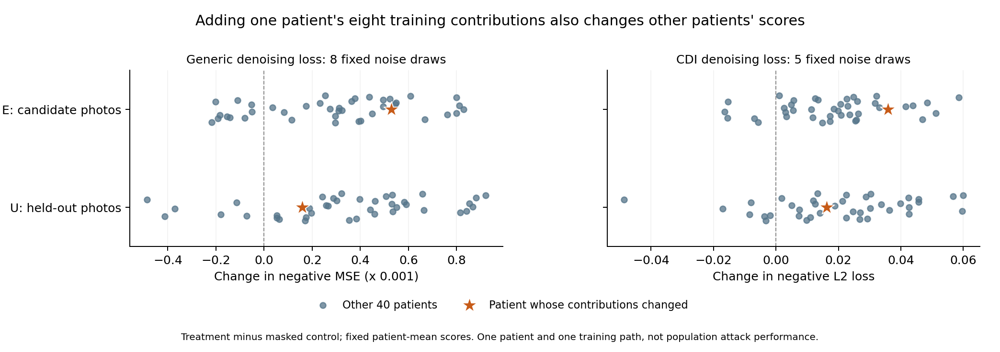

# 2번 추가 조사: 측정 변동·최적화 경로·한 환자의 학습 기여

2026-09-15 후속. 사용자의 “2번 더 해봐”에 따라 진행한다. [고정된 연구 목표와 네 단계](RESEARCH_FRAMEWORK.md)를 유지한다. 현재는 **2번: 기존 방법의 구체적인 실패 조건과 원인 확인**이며, 아래 개별 검산 PASS는 새 방법의 성공이나 2번 전체 완료가 아니다.

이 실험의 E/U·참여 정답은 통제한 LoRA 미세조정 자료에 관한 것이다. 공통 base 모델의 사전학습에 해당 자료가 있었는지는 unknown으로 유지한다.

**완료 결과:** 반복 평균화·MoFit 교차 적용·한 환자의8개 학습 기여 제거·출력 벡터 분해·전체 CDI26D와 기존 환자 판별기 대조까지 실제 수행하고 검산했다. 이 환자의 기여가 자기 미학습 사진 U에도 영향을 준 것은 확인했다. 다만 다른 환자에게도 변화가 퍼지며, 대상 환자를 보조학습에서 제외한 기존 고정C 주4방법의 자기 U 변화는 모두 다른40명의 방법별 사분위 범위 안이었다. 일부 기존 방법은 양의 변화를 포착했다. **기존 방법의 전면 실패나 새 해결 원리의 확보를 선언하지 않는다.** 현재의 구체적인 미해결 질문은 학습 기여의 영향을 관측하는 것에서 더 나아가, 제한 접근으로 그 환자의 참여를 구별할 수 있는 정보가 무엇인가이다.

## 왜 이 대조를 추가했는가

기존에 약한 점수와 일부 U-fit 개선은 관측했지만, 측정 noise·사진별 최적화·전체 학습 환자군 변화가 섞여 있었다. 이를 각각 고정하거나 실제로 바꾸는 대조를 진행한다. 기존 R을 미세 조정하거나 노출 횟수를 늘려 좋은 결과를 고르는 작업이 아니다.

| 확인할 질문 | 고정한 대조 | 진행 상태 |
|---|---|---|
| 기존 DL의 noise5 평균이 무엇을 바꾸는가 | 저장 CDI t100 DL, selection40 E2/U2 × 두 target, 320 packets | CPU 분석·저장 산술 검산 완료 |
| 이전 t140 결과가 특정 noise 한 개에 민감한가 | 같은 40명, original noise0 + 고정 신규7, 모든 seed·평균1/2/4/8 | 신규2,240F·236.278초, 저장 입력/산술 검산과 고정 통계 완료 |
| MoFit 모델 차이와 embedding 최적화 차이가 섞였는가 | 저장8 embedding × 4사진 × 두 recipient × noise5, null 포함360F | 360F·62.644초, 원형16출력 exact 복원과 별도 검산 완료 |
| 특정 환자 E의 학습 기여는 E/U와 다른 환자에 어떻게 전달되는가 | 원래 M1 1,000step exact 재현 뒤 동일 순서의8슬롯만 masked loss control | 두 학습1,041.280초·독립 검산13.882초, endpoint2,260F·256.057초·독립 검산53.028초 완료 |
| DL 하나의 문제인가, 전체 기존 특징·환자 집계에서도 같은가 | control U82장 원형CDI26D, 기존18방법 및 p를 제외한U79 보조학습 | 4,801F/1,439B·562.766초, 원시 검산·1,517점수 독립 감사 완료 |

## 저장 CDI DL5에서 직접 확인한 결과

저장된 noise 1,600개와 DL320개를 재생·검산하고, 사전에 고정한 모든 seed와 prefix평균1/2/4/5를 표시했다. CPU 실행은24.112초이며 새 GPU0이다. 다음은 원형 L2의 부호를 반전한 뒤 환자 두 장을 평균한 U 결과다.

| 조건 | 모델1 AUC | 모델2 AUC |
|---|---:|---:|
| 첫 noise 한 개 | .4925 | .5125 |
| noise5 평균 | .4900 | .5150 |
| 평균5−첫 noise의95% paired 구간 | [−.0775,.0700] | [−.0700,.0775] |

이 고정 t100 DL에서는 평균5가 탐지력을 회복했다는 근거가 없다. 전체 환자 점수 분산 중 평균5의 추정 noise 분산 비율은 U mean에서 약1.83%/1.86%다. 하지만 전체 분산에는 환자·질환·영상 난이도 차이가 들어갈 수 있으므로 **membership 신호보다 noise가 작다는 판정이 아니다.** 다른 공격·시점 또는 누출 부재로 일반화하지 않는다.

[원시 기반144 AUC·48차이·분산층](../../code_working/_reports/cvpr_u_pilot_v1_001/baseline_screen_20260915/cdi_saved_dl_repeats_v1/analysis.json) · [사후 진단 계약](spec_sources/cdi_saved_dl_repeats_contract_20260915b.json)

## t140 반복 측정: 평균만으로 판별이 회복되는가

원래 generic t140의 selection40 E2/U2 × 두 모델에서 noise0를 그대로 재사용하고, 사전에 고정한 일곱 noise를 추가했다. 새2,240F/0B에236.278초가 걸렸다. 저장된2,560개 입력·출력과 원형320개 재사용을 확인하고, 모든 단일 noise와 평균1/2/4/8의192AUC·48개 paired 차이 구간을 계산했다. 아래는 이미지별 noise MSE를 먼저 평균한 뒤 음의 점수를 환자 두 장에서 평균/최대로 집계한 값이다.

| 자료·집계 | 모델1: 1회 → 8회 평균 | 모델2: 1회 → 8회 평균 |
|---|---:|---:|
| E mean | .3850 → .4325 | .6200 → .5675 |
| E max | .4475 → .4675 | .5675 → .5350 |
| U mean | .4725 → .4425 | .5400 → .5550 |
| U max | .4900 → .5050 | .5125 → .4925 |

48개 평균화 대비 차이의95% 구간은 모두0을 포함했다. U mean의8회−1회 차이는 모델1 −.0300 [−.1000,.0250], 모델2 +.0150 [−.0350,.0650]이다. 표준 평균화가 이 조건의 U 판별을 회복시킨다는 근거는 얻지 못했다. 이는 반복 측정의 일반적 무용성이나 다른 timestep·공격의 실패를 입증하지 않는다.

U mean의 단일 측정 ICC는 .9287/.9300이고, 서로 겹치지 않는4회 평균 두 묶음 간 순위 상관은 .9715/.9683이다. **환자 간 점수 순위가 안정적이라는 것과, 그 순위가 참여 여부를 잘 나타낸다는 것은 다르다.** 두 target의 학습 환자군이 통째로 다르므로 그 차이를 개인 한 명의 참여 효과로 취급하지 않는다. 참고로8회 평균의 참여 방향 정렬 target 차이는 E mean +.0004213 [.0001976,.0006431], U mean −.0000114 [−.0002629,.0002467]이다. E−U 차이의 유의성을 별도로 검증한 결과가 아니며, 한 구간만0을 제외한다는 이유로 두 효과가 다르다고 선언하지 않는다.

최초 검산은 FP32 noising 결과를 이상적 FP64 값에 고정 허용오차로 대조하다가 큰 두 항이 상쇄되는10원소에서 실패했다. 예를 들어 실제 오차1.188069e−7은 당시 허용1.184138e−7을 조금 넘었다. GPU 자료를 바꾸거나 다시 계산하지 않았다. 별도v2는 **2,560개 모든 입력의 CPU FP32 연산 exact 일치**와 계수·곱셈·덧셈 반올림의 항별 오차 상한을 동시에 확인했다. 최대 오차/상한=.959이고, 원형 검산기·실패 재현·새 검산기를 모두 보존했다. 수정한 것은 이 수치 기준뿐이며 분석 정책은 그대로다. CPU 검산15.360초, 통계2.846초였다.

[전체 고정 통계](../../code_working/_reports/cvpr_u_pilot_v1_001/baseline_screen_20260915/repeat_noise_t140_v1/analysis_v2/analysis.json) · [v2 검산](../../code_working/_reports/cvpr_u_pilot_v1_001/baseline_screen_20260915/repeat_noise_t140_v1/verification_v2.json) · [원 실패 재현](../../code_working/_reports/cvpr_u_pilot_v1_001/baseline_screen_20260915/repeat_noise_t140_v1/verification_v1_failure_reproduction.json)

별도 담당자가 원 저장 scalar로 환자 점수7,680개·192AUC와 각2,000bootstrap·48paired구간·16ICC·104paired변화를 독립 재계산했다. AUC와 paired AUC 구간의 차이는0, 최대 점수 차이는 합산 순서에 따른1.42e−14였다. CPU1.593초, 새GPU0. [독립 통계 검산](../../code_working/_reports/cvpr_u_pilot_v1_001/baseline_screen_20260915/repeat_noise_t140_v1/independent_statistical_audit_20260915b.json).

## MoFit: 모델을 바꾼 효과와 최적화 입력을 바꾼 효과

한 환자14393의 E2/U2에서 이미 얻은 두 모델의 최종 embedding8개를 고정했다. 두 recipient model 각각에 모든 embedding을 교차 적용하고, 같은 사진의 null 점수를 뺀 h를 원래 noise와 고정 신규4noise에서 계산했다. 새 최적화 없이360F/0B/0VAE·62.644초였다. 원형 h8개와 null8개의 전체 prediction·noisy input·target을 exact 복원했고, 저장 산술·출처의 별도 검산은9.523초였다.

같은 query에 대해 A=h(M1,e1), B=h(M1,e2), C=h(M2,e1), D=h(M2,e2)라 하면, 이전의 자기 embedding 비교 A−D는 아래 두 항의 합으로 정확히 분해된다.

- 고정 embedding에서 recipient model을 바꾸는 항: ((A−C)+(B−D))/2.
- 고정 recipient에서 학습된 embedding을 바꾸는 항: ((A−B)+(C−D))/2.

이는 대수적 교차 대조이며 환자 개인의 인과효과 추정이 아니다. 평균/최대는 A/B/C/D 각각의 환자 점수를 먼저 만든 뒤 같은 식으로 분해했다. 신규noise4평균은 셀별로 먼저 평균한다.

| 조건·집계 | 원 대각선 차이 A−D | recipient 항 | embedding 항 |
|---|---:|---:|---:|
| 원noise E mean | +.00360672 | +.00078187 | +.00282485 |
| 신규4평균 E mean | +.00644858 | +.00029277 | +.00615581 |
| 원noise U mean | +.00459695 | −.00024678 | +.00484373 |
| 신규4평균 U mean | +.00029508 | +.00045714 | −.00016205 |
| 원noise U max | −.00053361 | −.00167212 | +.00113851 |
| 신규4평균 U max | −.00245494 | +.00016527 | −.00262021 |

원noise U mean의 양의 차이는 주로 embedding 교체 항에 배정된다. 따라서 이전 +.00459695를 고정 probe에 대한 모델 차이라고 해석할 수 없다. 각 모델에서 얻은 embedding을 그대로 두고 noise만 바꾼 자기-embedding 대각선 차이(A−D)의 U mean은 신규noise4개에서 +.00298724, −.00299526, −.00184083, +.00302918로 방향도 바뀐다. 반면 E mean의 신규4평균 차이는 +.00644858로 남아 있다. 두 결과를 함께 보고한다.

**embedding 최적화 자체가 유효한 학습 정보를 담을 가능성은 남아 있다.** 이 대조는 신규noise마다 embedding을 다시 최적화한 원형 MoFit 성능 비교가 아니다. noise 교체에 민감하다는 사실만으로 원형 공격 실패·신호 부재를 확정하지 않는다. 교차 사진 반응도 존재하므로 단순히 자기 사진만 반응한다고 설명할 수 없다. 이 결과의 역할은 이전 한 환자 대조의 해석을 좁히는 것이며 새 공격 기여를 만드는 것이 아니다.

[전체 행렬·고정 분해](../../code_working/_reports/cvpr_u_pilot_v1_001/baseline_screen_20260915/mofit_cross_response_v1/analysis_v1/analysis.json) · [독립 검산](../../code_working/_reports/cvpr_u_pilot_v1_001/baseline_screen_20260915/mofit_cross_response_v1/verification.json)

## 한 환자의 학습 기여를 직접 제거하는 대조

기존 M1/M2는 학습 환자군 전체가 달라서, 어떤 환자의 반응 차이가 바로 그 환자 자료의 사용 때문에 생겼는지 분리할 수 없었다. 이번에는 **M1의 학습 경로를 그대로 재현하고, 환자14393의 E 두 장이 등장한8개 슬롯의 loss 기여만0으로 만든다.** 나머지 사진·순서·noise·timestep·학습 prompt·AdamW·gradient clipping·loss 분모는 같다. p의 최초 기여는44단계이며, 그 전43단계와 초기 상태가 두 실행에서 exact 동일한지 확인한다.

원래 1,000단계 학습은250/1,000 체크포인트 전체와 매 단계 loss·gradient norm에서 exact 재현을 통과했다. 원형 최종 파일 SHA256도 `ae789c32ce9ebaca3eb568fda968c28d5b9cbdf39682d7a498615b26cbb08435`로 같았다. 이 재현에514.565초가 걸렸고, control을 이어 실행했다. 원본 학습 코드·checkpoint는 바꾸지 않았다. 새 runner는 원형 학습 함수의 AST에서 출력·감사 호출과 지정8개 loss 기여 처리만 명시적으로 바꾼 별도 코드다.

예정4,000슬롯과 업데이트1,000회는 같지만 실제 비영 기여는4,000 대3,992다. 환자 자료를 manifest에서 지우고910장으로 새로 섞는 일반적인 재학습과는 다르다. 특정8개 기여를0으로 한 뒤 Adam 상태와 이후 gradient가 달라지는 효과까지 포함한다. 이는 한 환자·한 학습 난수 경로의 개입이며 여러 환자에 대한 평균 효과나 DP 이웃 데이터셋 정리를 입증하지 않는다. 실험자가 원인을 살피기 위한 대조이며, 외부 감사자가 이 control 모델을 만들 수 있다고 가정하는 공격법도 아니다.

두 학습은 총1,041.280초(17분21.3초)에 끝났고 실제8,000 root forward examples/2,000 backward calls였다. 독립 CPU 검산13.882초에서 원형250/1,000과 공통43의 전체 상태, 입력1,000쌍, 실제 비영 노출4,000/3,992,16개 저장 mask 지점의 prediction-gradient를 대조했다. CPU autograd와 FP16 closed-form gradient가 저장값에 exact일치했다. 전체 신경망 gradient를 CPU로 다시 계산한 검산은 아니다. CUDA FP16 noise도 CPU에서 새로 재현한 것이 아니라 두 branch의 저장 hash와 mask raw를 결속해 확인했다. [별도 학습 검산](../../code_working/_reports/cvpr_u_pilot_v1_001/baseline_screen_20260915/masked_patient_training_v1/verification.json).

endpoint는 미리 다음으로 고정했다.

| 평가 | 자료 | 새 forward / 재사용 |
|---|---|---:|
| generic t1408noise | 해당 환자1명 + 기존 selection40명, 각각 E2/U2 | 1,340 / 1,284 |
| 기존 CDI DL t1005noise | 같은164장 | 820 / 820 |
| M1에서 고정된 MoFit4embedding와 null | 해당 환자 E2/U2, noise5 | 100 / 100 |
| 합계 | 저장4,464cells, 신규 최적화·backward 없음 | 2,260 / 2,204 |

각 family의 원래 latent·noising·FP32 loss 연산을 유지하고 FP64 잔차도 보관한다. 모든 noise·정한 prefix 평균·환자 mean/max를 보고한다. 선택 환자40명의 A/B/all 변화 분포와 해당 환자1명의 변화를 대조하되, 이 자료로 새로운 scorer·threshold·AUC를 고르지 않는다. MoFit에는 다른40명 자료가 없으므로 그 비교를 만들지 않는다.

추가로 저장 prediction만 사용해, 같은 image/noise에서 두 모델의 출력 차이를 δ, control의 잔차를 r이라 둘 때 **ΔMSE = (2r·δ + ‖δ‖²)/D**를 FP64로 분해한다. 출력 벡터의 변화와 scalar loss의 변화가 다르게 보이는 이유를 살피는 진단이다. 사전 정책은 모든 image와 환자 mean으로 제한한다. max에서 서로 다른 사진을 선택하는 문제에 이 선형 식을 억지로 적용하지 않는다. 출력 변화가 큰데 loss에서 상쇄되는지, 다른 환자에서도 비슷한 변화인지 확인하기 위한 것으로, scalar화가 원인이라는 결론을 미리 정하지 않는다.

[학습 계약](../../code_working/_reports/cvpr_u_pilot_v1_001/baseline_screen_20260915/masked_patient_training_contract_v1.json) · [검토 가능한 원형 변환 함수](../../code_working/_reports/cvpr_u_pilot_v1_001/baseline_screen_20260915/masked_patient_training_preparation_v1/transformed_training_kernel.py) · [실제 endpoint 계약](../../code_working/_reports/cvpr_u_pilot_v1_001/baseline_screen_20260915/masked_slot_endpoints_contract_v2.json) · [출력 벡터 분해 사전 정책](../../code_working/_reports/cvpr_u_pilot_v1_001/baseline_screen_20260915/endpoint_prediction_delta_policy_v1.json)

endpoint 검산기 준비가 예상보다10분 늦어져 사용자에게 알렸다. 계산과 검산기 준비를 병행하려고 producer v1을 보존한 명시적v2를 만들었다. 바뀐 것은 미완성 검산기 코드의 사전 hash 결속을 별도 검산 protocol로 옮긴 메타데이터뿐이며, 모든 수치 함수·분석 정책 AST는 같다. 실제 독립 검산기 코드가 GPU 전에 동결됐다고 소급 주장하지 않는다. 정책·producer·학습 검산·자료394개 파일을 묶은 v2 계약과 CPU preflight 후에 계산을 시작했다.

## 실제 개입 결과: U에 효과는 있지만 다른 환자도 함께 변한다

endpoint는 신규2,260F/0B·256.057초에 끝났다(`execution.json.seconds`; 실행기 최종 출력 시점256.087초). 저장4,464cells 전체의 별도 검산은53.028초였고, 원형2,204cell exact 재사용·394개 동결 입력·full FP32 가중치·학습 검산 연결을 통과했다. 서로 다른 담당자의 주범위656환자점수·48개 A/B/all 분포·MoFit432영상/480환자집계 재계산도 일치했다. FP32/FP64 주범위328개 변화와 MoFit240개 변화의 부호 차이는0개, max가 고른 사진 차이도0개다.

다음은 **환자14393의8개 기여를 포함한 treatment의 점수 − 그 기여를 제거한 control의 점수**다. 음의 loss 점수이므로 양수는 loss 감소를 뜻한다. 다른40명은 자신의 참여 여부가 그대로이며 같은 개입의 파급을 관측한 자료다.

| 고정 점수·집계 | 해당 환자 E 변화 | 해당 환자 U 변화 | 다른40명 U 변화 평균 | 다른40명 중 U 변화 양수 |
|---|---:|---:|---:|---:|
| t1408noise 음의 MSE mean | +.00052933 | +.00015874 | +.00034388 | 34/40 |
| t1408noise 음의 MSE max | +.00063094 | +.00030691 | +.00039694 | 33/40 |
| CDI t1005noise 음의 L2 mean | +.03584785 | +.01622009 | +.02018456 | 33/40 |
| CDI t1005noise 음의 L2 max | +.03508148 | +.02244263 | +.02130493 | 34/40 |

**이 환자의 학습 기여가 자기 U 반응에도 영향을 준 것은 직접 관측했다.** 따라서 “U에는 학습 효과가 전혀 없다”는 설명은 맞지 않는다. 하지만 자기 U의 변화는 다른40명의 분포 안에 있고, mean에서는 다른40명의 평균보다 작다. 다른 환자 A/B 두 군에서도 평균 변화가 양수다. 즉 현재 scalar 점수의 변화 자체를 그 환자에게 특이적인 참여 신호로 해석할 수 없다. “의료 지식의 일반화 때문”이나 “수치 학습 경로의 민감성 때문” 중 어느 것이 이 파급을 설명하는지도 이 한 개입만으로 구별하지 않았다.

그림은 모든 다른 환자40명과 해당 환자를 같은 고정 mean 조건에서 표시한다. E는 설계상 학습 후보 사진이며, 다른 환자 B군의 E까지 M1 학습에 사용됐다는 뜻은 아니다. [SVG](measurement_audit_artifacts/masked_contribution_effects.svg) · [표시한164행 CSV](measurement_audit_artifacts/masked_contribution_effects.csv).

고정 M1 자기-embedding MoFit h의 개입 차이는 원noise에서 E mean +.00131935, U mean −.00008909이고, 신규4noise 평균에서는 E mean +.00044708, U mean +.00022213이다. U mean의 신규noise별 값은 +.00083356, +.00020386, +.00062630, −.00077520이다. 모든 조건·seed·pool을 보존했으며 control에서 embedding을 다시 최적화한 원형 공격 비교가 아니다.

[전체 endpoint 결과·고정 집계](../../code_working/_reports/cvpr_u_pilot_v1_001/baseline_screen_20260915/masked_slot_endpoints_v2/analysis_v1/analysis.json) · [독립 raw 검산](../../code_working/_reports/cvpr_u_pilot_v1_001/baseline_screen_20260915/masked_slot_endpoints_v2/verification.json) · [별도 집계·정밀도 대조](../../code_working/_reports/cvpr_u_pilot_v1_001/baseline_screen_20260915/masked_slot_endpoints_v2/independent_fixed_endpoint_summary_audit.json)

## Scalar가 숨긴 큰 환자 특이 벡터 변화가 있는가

저장된2,232쌍의 prediction으로 사전 식을 FP64·별도 합산으로 확인했다. 최대 항등식 오차는5.44e−17이고 CPU11.007초였다. 여기 ΔMSE는 **treatment loss − control loss**로, 위 음의-loss 점수 변화와 부호가 반대다.

| 해당 환자 U mean | 투영항 2r·δ/D | 제곱항 ‖δ‖²/D | 합 ΔMSE | 출력 변화 RMS | 다른40명 중 그보다 작은 RMS 수 |
|---|---:|---:|---:|---:|---:|
| t1408noise | −.00056393 | +.00040520 | −.00015873 | .02012956 | 12/40 |
| CDI t1005noise의 MSE 진단 | −.00069249 | +.00041039 | −.00028210 | .02025814 | 7/40 |

두 항이 상쇄되는 것은 실제다. 그러나 출력 변화의 크기 자체도 다른40명보다 두드러지지 않는다. 따라서 **“loss가 큰 환자 특이 신호를 숨겼으니 벡터 크기로 복원하면 된다”는 해결 원리는 이 자료가 뒷받침하지 않는다.** 서로 다른 방향·관계에 다른 정보가 남는지까지 부정한 결과는 아니다. 이 분해는 CDI 원형 L2 특징을 새 MSE 공격으로 바꾼 것이 아니라, 저장 prediction의 변화 원인을 살피는 별도 진단이다.

[벡터 분해 결과·한계](../../code_working/_reports/cvpr_u_pilot_v1_001/baseline_screen_20260915/masked_slot_endpoints_v2/prediction_delta_v1/analysis.json) · [환자별 전 항목](../../code_working/_reports/cvpr_u_pilot_v1_001/baseline_screen_20260915/masked_slot_endpoints_v2/prediction_delta_v1/patient_means.json) · [A/B/all 기술 분포](../../code_working/_reports/cvpr_u_pilot_v1_001/baseline_screen_20260915/masked_slot_endpoints_v2/prediction_delta_v1/reference_context.json)

## 전체 CDI26D·강한 기존 환자 집계까지 실제 대조한 결과

위 DL 하나를 전체 CDI의 결과로 확대하지 않기 위해, control U82장(해당 환자1명+selection40명)을 공개 코드 원형26D 전체로 새로 추출했다. 원래 M1의 특징·noise는 그대로 재사용하고 기존18방법을 동일하게 적용했다. 새 추출은4,801F/1,439B, 실행기562.766초(9분22.8초), 그중 scoring535.581초였다. 이는 CDI 특징 kernel과 환자 MIA 확장이며, 원논문의 reference-set 통계검정 전체 재현을 뜻하지 않는다.

독립 CPU 원시 검산21.528초에서2,132특징·656noise와 실제 control의3,992개 기여·대상 환자0·모든U의 영상 노출0을 확인했다. 이전 endpoint의 control DL410개 입력·prediction·noise·원형GPU L2가 exact 재현됐다. GM/NO의 저장 gradient·산술을 확인한 것이며 전체 신경망 Jacobian을 새로 계산한 검산은 아니다. 실제 masked checkpoint·가중치는 별도로 확인했고, 옛 산술 검산기의 model enum 호환용 표기를 실제 model1로 혼동하지 않는다.

대상 환자는 원래 공격 판별기 fit80에 포함돼 있었다. 이 판별기의 전후 반응은 그 사실을 붙인 보조 결과로 보존했다. 추가로 **해당 환자를 제외한 기존 U79(참여39/비참여40)의 자료만으로** 같은 C의 scaler/LR를 맞춰 양쪽 target에 동일 적용했다. control·selection 자료를 fitting하거나 C를 새로 고르지 않았다. 이 정책은 새 control26D 결과 전에 정했다. 주 비교는 원래부터 C=1로 고정한 네 방법이며, 과거 fit80에서 골랐던 tuned C는 환자 제외 후에도 clean 주 비교로 부르지 않는다. U79는 공격 판별기의 직접 보조학습에서 해당 환자를 제외한 것이지, 원래 M1이 생성한79명의 특징까지 그 환자의 학습 기여와 무관하다는 뜻은 아니다.

다음 값은 저장 LR의 출력 점수이며, 보정된 실제 참여 확률이 아니다. Δ는 **treatment−control**이다. 사분위 범위는 참여 상태가 그대로인 다른40명의 점수 변화 중 가운데50%를 뜻하며, 신뢰구간이나 검정 기준이 아니다.

| U79 고정C 주 비교 | 해당 환자: 기여 포함 점수 | 기여 제거 점수 | 해당 환자 Δ | 다른40명 Δ 사분위 범위 |
|---|---:|---:|---:|---:|
| 이미지26D LR → 환자 mean | .819266 | .822690 | −.003424 | [−.021842, +.025962] |
| 같은 이미지 LR → 환자 max | .892993 | .865266 | +.027727 | [−.016994, +.040083] |
| 환자 mean26 → LR | .916389 | .909740 | +.006649 | [−.034925, +.037979] |
| 환자 mean+max52 → LR | .760320 | .701524 | +.058796 | [−.045061, +.072778] |

세 방법은 양의 참여 기여 반응을 보였다. 따라서 **기존 방법이 전부 아무 효과도 포착하지 못했다는 결론은 틀리다.** 동시에 네 방법 모두 해당 환자의 변화가 다른40명 변화의 사분위 범위 안에 있다. 이 단일 개입에서는 해당 환자만 특별하게 분리된 반응을 입증하지 못했다. 이는 일반적인 네 공격의 실패·오탐률·성능 열세를 검정한 결과가 아니다.

같은 이미지 LR에서도 두 U 사진의 Δ가 +.027727/−.034575로 반대여서, mean은 음수이고 max는 양수가 된다. 표준 집계만 바꾸어도 이런 차이가 나므로 그 효과를 새 구조 모듈의 기여로 삼지 않는다. 반대로 보조 scalar의 SecMI mean Δ+.000956, PIAN mean Δ+.134346은 각각 다른40명 변화의 상위 사분위값(+.000224/+.077279)보다 크다. 모든 특징의 반응이 구별되지 않는다고 확대하지 않으며, 이 사후 기술 수치로 우수 방법을 선택하거나 환자군 성능을 선언하지 않는다. 원18방법·U79의18방법·고정DINO를 모두 보존했다.

분석은3.332초, 고정 정책의 LR10개 재학습에서 수렴 경고0이었다. 별도0.378초 감사에서 U79 대상 제외·라벨·동일C·스케일러·1,517환자점수·111분포·738원점수 복원을 확인했다. 원점수735개는 bitwise exact, 나머지는 최대1.11e−16이고, 독립 점수 재계산의 최대 차이는3.89e−16이다. 이 감사는 저장계수 적용과 fitting 입력·스케일러의 검산이며 solver 독립 재학습은 아니다.

[전체 점수·한계](../../code_working/_reports/cvpr_u_pilot_v1_001/baseline_screen_20260915/cdi_masked_u82_v1/fixed_scorer_analysis_v1/analysis.json) · [1,517행](../../code_working/_reports/cvpr_u_pilot_v1_001/baseline_screen_20260915/cdi_masked_u82_v1/fixed_scorer_analysis_v1/patient_scores.json) · [모든 A/B/all 분포](../../code_working/_reports/cvpr_u_pilot_v1_001/baseline_screen_20260915/cdi_masked_u82_v1/fixed_scorer_analysis_v1/selection_context.json) · [원시 검산](../../code_working/_reports/cvpr_u_pilot_v1_001/baseline_screen_20260915/cdi_masked_u82_v1/verification.json) · [독립 점수 감사](../../code_working/_reports/cvpr_u_pilot_v1_001/baseline_screen_20260915/cdi_masked_u82_v1/fixed_scorer_analysis_v1/independent_saved_scorer_audit.json)

## 원문·실행 범위

[미사용 자료로 사용자 참여를 보는 원문 추가 대조](spec_sources/stage2_user_inference_source_bridge_20260915b.md)에서 EMNLP2024와 SatML2023의 선택 절을 새로 확인했다. U 설정·reference 평균·자료 응집도 자체의 신규성을 주장하지 않는다.

[MoFit의 사진·모델·noise 교차 사전 해석](spec_sources/stage2_mechanism_candidates_20260915b.md) · [원래 학습 상태와8슬롯 기여 대조](spec_sources/stage2_training_contrast_options_20260915b.md) · [t140 반복 계약](spec_sources/repeat_noise_t140_contract_20260915.json)

## 이번에 확인한 것과 아직 필요한 연결

이번 지정 대조는 모두 끝났다. 확인한 것은 한 환자의 학습 기여가 자기 U에도 비영 효과를 만들지만 다른 환자에게도 변화가 퍼진다는 점, 기존 집계에 따라 포착하는 방향이 달라진다는 점이다. 표준 noise 평균이나 출력 벡터 크기만으로 현재 문제를 해결한다는 설명은 지지되지 않았다. **이제 살필 질문은 제한된 U 사진과 허용된 모델 접근만으로 자기 환자의 참여를 구별할 근거를 얻을 수 있는가이다.** 여기에서 사용한 두 checkpoint는 연구자용 개입 대조이며 외부 감사자가 사용할 수 있는 공격 입력으로 제안하지 않는다.

한 환자·한 학습 경로의 결과이므로 환자군 전체 실패 원인, 타 환자에게 퍼지는 효과의 일반화/수치 경로 원인, 강한 대안을 넘는 환자 특이 정보, 이를 보존하는 새 연산은 확정하지 못했다. 의료 MoFit의 환자군 성능·Eq9 보정도 미완료다. 따라서 **2번을 계속 진행할 근거는 구체화했지만 3번의 새 설계가 준비됐다고 말할 단계는 아니다.** 다음 계산은 이 남은 설명들을 구별할 관측·예측과 비용을 특정한 뒤 실행해야 하며, 기존 R을 조금씩 고치는 것으로 대체하지 않는다.

이번 요청에서 실제 GPU를 사용한 다섯 실행의 기록된 시간 합계는2,159.024초, 약35분59초다. 준비·코드와 원문 확인·독립 검산·기록 시간은 별도이며 전체 작업 시간과 혼동하지 않는다. F/B는 각 실행에 명시한 논리적 호출/예제 수로, 학습의 gradient checkpoint 내부 재계산까지 동일 질의 비용으로 센 값이 아니다. 현재 실행 중인 GPU 작업은 없다. 보정·시험 분할은 열지 않았고, 별도 졸업논문 K5/K10 계약은 변경하지 않았다.
