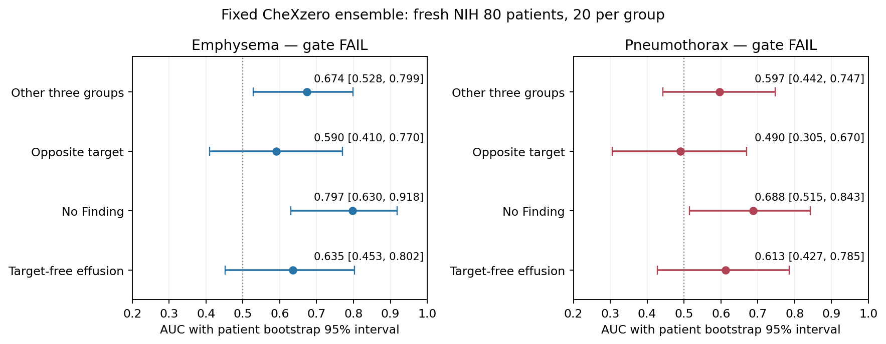

# 방향1: CheXzero 실제 NIH80명 검증 결과

**판정: 나쁜 결과다. 마지막 단일 대안 CheXzero도 두 질환 모두 사전 운영 관문을 통과하지 못했다. 이 폐기종·기흉 공동 가설에서 classifier 탐색을 종료하고, classifier에 의존한 targeted 생성 경로를 보류한다.**

이번에는 준비에 그치지 않았다. 예약한80명·80장을 공식10개 checkpoint ensemble로 실제 추론했다. 폐기종의 rest/opposite AUC는 **0.6742/0.5900**, 기흉은 **0.5967/0.4900**이다. 공식 CPU와 GPU 대응 검사 및 독립 pixel/통계 검산은 통과했다. 구현 검산 PASS를 평가기 성능 성공으로 바꾸지 않는다.

2026-09-17, 큰 단계2·방향1. [실행 전 명세](TRACK1_CHEXZERO_VALIDATION_PROTOCOL_20260917.md) · [후보 검토](TRACK1_CHEXZERO_REVIEW_20260917.md) · [직전 PadChest 실패](TRACK1_PADCHEST_VALIDATION_RESULTS_20260917.md). 이 결과는 생성모델·private head의 효과를 직접 시험한 것이 아니므로 patient-private adaptation 전체의 반증은 아니다. **현재 두 조건의 private 생성 효용은 여전히 미확인이다.**

## 1. 실제로 실행한 범위

직전 예약 manifest를 byte 그대로 사용했다. 환자당 hash로 선택한 PA 영상1장, 폐기종+/기흉−20명, 기흉+/폐기종−20명, 두 target 없는 흉수20명, target/흉수 없는 환자의 No Finding 영상20명이다. ‘E-only/P-only’는 상대 target이 없다는 뜻이며 다른 동반질환이 전혀 없다는 뜻이 아니다. NIH weak label의 부재는 임상적으로 확정된 질환 부재와 다르다.

공식10개 checkpoint 모두를 실행했고 좋은 checkpoint만 고르지 않았다. 네 문자열·전처리·patient manifest·GPU precision·score·AUC gate·bootstrap·수치 허용오차·생산/독립검산 source를 추론 전에 한 contract에 결속했다. 새로운 환자·prompt·temperature·모델 조합을 결과에 맞춰 추가하지 않았다.

공식 방식대로 각 checkpoint의 positive/negative cosine에 pair softmax를 적용한 뒤 평균했다. CLIP logit_scale 미적용, template `{}`/`no {}`, GPU FP32. 개별모델 cosine와 pair-score는 검산용으로 저장했으며 개별 AUC를 이용한 선택은 하지 않았다.

## 2. 조건 구별력 — 두 target 모두 실패

|출력 / 양성군|대조군|양성/음성|AUC (95% CI)|AP / prevalence|
|---|---|---:|---:|---:|
|Emphysema|나머지 세 군|20/60|0.6742 (0.5283–0.7992)|0.4234 / 0.2500|
|Emphysema|상대 target|20/20|0.5900 (0.4100–0.7700)|0.5822 / 0.5000|
|Emphysema|No Finding|20/20|0.7975 (0.6299–0.9176)|0.8316 / 0.5000|
|Emphysema|target-free Effusion|20/20|0.6350 (0.4525–0.8025)|0.6649 / 0.5000|
|Pneumothorax|나머지 세 군|20/60|0.5967 (0.4425–0.7467)|0.4377 / 0.2500|
|Pneumothorax|상대 target|20/20|0.4900 (0.3050–0.6700)|0.5713 / 0.5000|
|Pneumothorax|No Finding|20/20|0.6875 (0.5150–0.8425)|0.7513 / 0.5000|
|Pneumothorax|target-free Effusion|20/20|0.6125 (0.4275–0.7850)|0.7101 / 0.5000|

[그림 PDF](assets/chexzero_validation_auc_20260917.pdf). 각 AUC는 동일 출력에서 정해진 양성군과 대조군을 비교한다. 두 질환 출력의 score 절대값을 서로 교정된 확률로 비교하지 않는다.

사전 기준은 질환별 rest AUC≥0.70/95%하한>0.50, opposite AUC≥0.60/95%하한>0.50 모두다.

- **폐기종:** rest의 CI하한은0.5283으로0.5보다 높지만 점추정0.6742가0.70에 못 미친다. Opposite0.5900은0.60 미만이며 CI0.4100–0.7700이 우연 수준을 포함한다. 경계와0.01 차이라고 기준을 낮추거나 환자를 더 넣어 구제하지 않는다.
- **기흉:** rest0.5967/CI0.4425–0.7467, opposite0.4900/CI0.3050–0.6700. 이번 표본에서 다른 target과 구분한다는 근거를 확보하지 못했다.
- **부분적인 신호:** 정상 대비 폐기종0.7975, 기흉0.6875로 더 높다. 이 신호를 숨기지는 않지만, 정상/비정상 구분 일부만으로 질환 특이적 생성 평가기를 채택할 수는 없다.

이 결과는 ‘CheXzero가 모든 NIH 설정에서 쓸모없다’는 뜻이 아니다. 고정된 weak-label 환자군20명씩·현재 전처리/질의/운영 기준에서 후속 생성평가용 근거를 확보하지 못했다는 결과다. 표본과 동반질환·라벨 오류·기관 차이의 영향을 따로 인과적으로 분리하지 않았다.

앞선 PadChest0.5308과 숫자를 나란히 볼 수는 있지만 **서로 다른80명**이므로 CheXzero가 같은 환자에서 더 좋았다는 대응 비교로 쓰지 않는다. 외부 PadChest 원논문의0.8232/0.7659와 이번 NIH 결과도 데이터·라벨·대조군이 다르다.

## 3. 계산이 맞는지 실제로 확인했다

80장 전부 파일 SHA·PNG decode·공식 label/환자·PA view와 inventory의 cross-patient exact duplicate를 검사했다. 320 grayscale와224 float32 tensor·개별 tensor SHA를 저장했다. 독립 검산기는 OpenCV RGB decode와 고정 공식 `preprocess` 함수를 사용해320 입력을 다시 만들고, 별도의 tensor normalization/interpolation으로224 입력을 재계산했다. **80장 모두 exact equality**였다. Near-duplicate 임상 판정이나 weak label의 정답성을 검증한 것은 아니다.

각 질환군의 명부상 첫 환자1명, 총4명을 모든 checkpoint에서 CPU/GPU replay했다. 공식 `zero_shot.run_softmax_eval`을 CPU에서 직접 호출했고, encoder raw/normalized features, cosine, per-checkpoint score, 최종 ensemble을 GPU와 대조했다. 모델/환자를 결과 이후 고른 replay가 아니다.

|검산 항목|실측 최대 차이|
|---|---:|
|CPU–GPU normalized image/text feature|5.14e-07|
|CPU–GPU 각 checkpoint pair-score|1.19e-07|
|CPU–GPU 최종 평균 score|5.96e-08|
|독립 embedding→cosine 재계산|9.05e-08|
|독립 AUC/AP·bootstrap 재계산|3.33e-16|

모두 사전 허용오차 안이었다. CPU 공식 경로는 positive/negative마다 이미지를 반복 계산했고, 저장된 raw image feature도 같았다. 학습된 logit_scale을 잘못 곱하거나 단일 positive cosine을 최종 score로 사용한 경로가 아니다.

독립 metric 코드는 생산 함수를 import하지 않고 pair-count AUC와 threshold-block AP를 사용했다.8개 대조×2,000회 = **16,000개 patient bootstrap AUC/AP 쌍**을 전부 다시 계산했다. Independent **17,222항목 PASS**는 산술/결속 검사 수이며 새로운 환자 수나 성능 증거 수가 아니다. 검산기 자체가 모든 모델을 또 forward한 것은 아니며, 실제 모델 대조는 producer 안의 별도 공식 CPU/GPU 경로다.

점수가0.5 근처라는 사실만으로 구현 오류나 질환 확률50%라고 해석하지 않는다. 고정된 unscaled cosine의 pair-score이며, 이번 판정은 그 순위를 사용하는 AUC/AP로 했다. Temperature·threshold를 바꾸는 사후 구제는 하지 않았다.

## 4. 실행 비용과 보존

|실측|값|
|---|---:|
|전체 validation 프로그램|52.374초|
|GPU primary+replay inference|4.962초|
|CPU 공식 reference inference|7.511초|
|Metric/2,000 bootstrap 계산|8.304초|
|별도 독립 검산|10.489초|
|Peak GPU allocated / reserved|0.601 / 0.662GiB|
|GPU image calls / image-examples|110 /840|
|CPU image calls / image-examples|80 /80|
|GPU / CPU text-examples|40 /40|
|새 generator / 학습 / DP|0 /0 /0|

예상20–35분은 구현·문서·실행·검산을 포함한 작업 시간이었다. 위52초는 프로그램 실행 부분만이다. 첫 GPU 실행의 초기화 비용도 측정 구간에 포함한다. Pandas optional accelerator warning이 있었으나 metric/CSV는 고정 NumPy/SciPy/sklearn/stdlib 경로로 완료했고 환경은 바꾸지 않았다.

이번80명은 이제 실제 evaluator 결과를 소비한 환자다. `evaluator_exclusions_private.csv`를 새 사용이력 overlay로 남겼다. 준비 당시 reserved manifest와 과거 감사 ledger는 그대로 보존했다. 후속 생성 reference에서 이80명과 앞선 PadChest evaluator80명을 제외한다. Remaining development4,053명/E-only44명, 탐색 reference32명/군이라는 자원 제한은 유지한다.

Reserved confirmation4,213명은 ID 교집합만 확인했고 pixel·추론·tuning에 쓰지 않았다. 원래 졸논 분할·final/calibration/test, 고정 backbone/head, 과거192장·private utility 미통과, E4/CFG1 adoption 실패를 보존했다.

## 5. 이번 결과로 내리는 결정

**이 공동 가설의 classifier 탐색은 끝낸다.** 두 번째 평가기까지 고정 조건에서 실패했으므로 세 번째 모델, prompt 검색, checkpoint subset, 성공한 질환만 사후에 남기는 실험을 하지 않는다. KID나 raw text cosine만 좋아지는 것을 target-specific private 효용이라고 선언하지 않는다.

현재 중단 범위는 **폐기종·기흉 classifier 기반 targeted 평가 경로**다. 작은 public head의 생성 영향, 사용 이력상 분리된 평가자료, 기존 public/private 방향 차이는 남아 있다. 그러나 이 사실들이 private 생성 효용이나 patient-DP 기여를 대신하지 않는다. 이번에는 생성모델을 실행하지 않았으므로 private 효과 유무를 결론내릴 수 없다.

다음 실험은 자동으로 이어지지 않는다. 다음 설계 작업은20–30분의 **논문 수준 측정·자원 재검토**다. 실제 확보 가능한 전문 판독/신뢰할 주석 등 독립 측정 자원이 있으면 그 자원에 맞는 새 명세를 만들고, 없으면 현재 targeted 설정을 내려놓고 두 보호 연구 방향의 문제–측정–기여 연결을 다시 선택해야 한다. 자료가 없는데 또 다른 classifier만 돌리는 방식으로 이어가지 않는다. 방향2나 새 solver로 자동 전환하지도 않는다.

**좋은 측정 도구를 찾았다는 결과는 아니다. 이번 실행은 부정적이며, 정한 중단선을 실제로 적용한 결과다. CVPR 핵심 privacy 기여는 여전히 미확보다.**

## 6. 기록과 재현

실행 폴더: `code_working/_reports/chexzero_validation_20260917_v1`. 실제 selected manifest/tensor/320배열/HDF5,10개 checkpoint score/feature, CPU/GPU replay10개,patient score, bootstrap,metric,검산,새 consumed overlay를 보존했다.

[공개 집계 기록](spec_sources/chexzero_validation_20260917_v1/aggregate_record.json) · [전체 AUC/AP 및 CI](spec_sources/chexzero_validation_20260917_v1/metrics.json) · [실행 통계](spec_sources/chexzero_validation_20260917_v1/result.json) · [독립 검산](spec_sources/chexzero_validation_20260917_v1/verification.json). 공개 JSON만으로 로컬 환자 pixel 전체를 재검증했다고 주장하지 않는다.

- Contract SHA: `3315653399770ddb2cab55b9ecf9f55f0ea0fb8df06a9d7592be9e3597394d67`
- Result SHA: `a77a5c42d53c7eb57cdb3aab570453c7b56fb8c29389cb9868b160f02f125b38`
- Metrics SHA: `f153f383896560b5ddefa013a734abca93b995929fe7903c1bf72f480e52588e`
- Selected80 manifest SHA: `7494944befbf199d3ac4cc3dbca1b34ff9b29a0d9b540a1c6114c4c4052110dd`

원격 main 확인/push는 이번 범위에 포함하지 않았다. 모든 판단은 로컬 실제 실행 기록에 근거한다.
