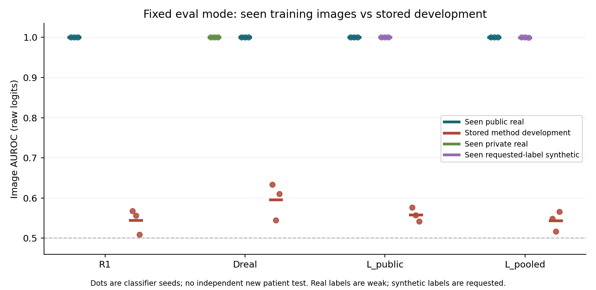
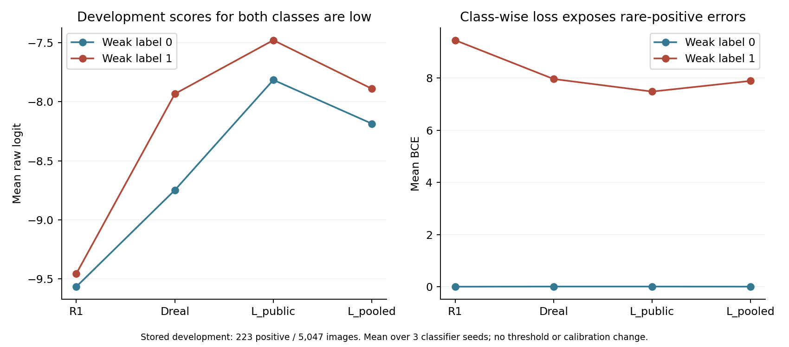

# 고정 분류기 진단: 학습자료에서는 거의 완벽하지만 개발자료에는 일반화되지 않았다

2026-09-17 KST. **진단에는 유의미한 결과다. 방법 효용의 음성 판정은 그대로이며, 공통된 학습–개발 일반화 차이를 직접 확인했다.**

저장된 R1·Dreal·L_public·L_pooled의 12개 분류기를 변경 없이 평가했다. 실제로 본 실영상은 모든 모델·source에서 AUROC/AP **1.0**이었고, 합성 요청 라벨도 AUROC **0.9990–1.0**이었다. 반면 기존 개발 AUROC 평균은 **0.5436–0.5962**다.

즉 **평가 모드에서 학습자료부터 구별하지 못하는 현상은 이번 검사에서 관측되지 않았다.** 학습자료에서 얻은 구별 성능이 개발 실영상으로 충분히 이어지지 않는다는 사실은 확인됐다. 이를 분류기 과적합 하나의 인과적 증명이나 생성기 무관의 증명으로 해석하지 않는다.

새 학습·생성·DP는 모두0이다. Expert final532명과 reserved4,213명은 계속 닫아두었다. 기존 full64 및 고정 LoRA의 사적 추가 효용 미통과 기록도 변경하지 않았다.

## 1. 실행 전 범위와 실제 실행

[사전 명세](TRACK1_CLASSIFIER_GENERALIZATION_PROTOCOL_20260917.md)를 작성하고 checkpoint·trace·입력·코드를 실행 계약에 동결한 뒤 추론했다. [실행기](../../code_working/classifier_generalization/run.py)는 기존 평가와 같은 증강 없는224 letterbox·ImageNet normalization·FP32·batch32·eval()·inference_mode()를 사용했다.

| 항목 | 범위 |
|---|---|
| 고정 checkpoint | R1, Dreal, L_public, L_pooled × seed11/23/37, 모두 기존400step |
| 학습자료 주 분석 | 해당 checkpoint의 실제 trace에 등장한 고유 영상만 |
| 전체 고유 학습영상 | 1,389장: 공개813·사적320·LoRA 합성256 |
| 모델별 학습영상 추론 합계 | 11,201회; 중복 제시 횟수가 아닌 각 모델의 고유영상 수 합계 |
| 기존 평가 경로 대응 | 저장 개발 순서의 첫64장 ×12모델 =768회 |
| 새 classifier image forward | 총11,969회; 새 모델 학습0 |
| 비교 개발자료 | 기존2,026명·5,047장 예측 재집계, 양성223장 |
| 원본 파일 범위 | 학습1,389장+개발 경로 검사64장=1,453개 허용 파일 |

모델별로 실제 학습에 등장한 공개 영상은 R1에서807/809/810장, 다른 세 arm에서788/778/783장이다. Dreal의 private320장, 두 LoRA arm의 해당 synthetic128장은 세 seed 모두 실제로 사용했다. 명부에 있었으나 해당 run에서 한 번도 추출되지 않은 영상은 제외했다.

이미 사용한 학습·개발자료를 다시 평가한 진단이며 새 독립 확인은 아니다. 원본 역할표와 사용 환자 범위를 재배정하지 않았다.

## 2. 동일 평가 경로의 결과

다음은 각 seed별 metric을 계산한 뒤 평균한 값이다. 개발 점수는 이전 실험과 같은 checkpoint의 저장 예측이다.

| 분류기 | 실제로 본 공개 real AUROC | 실제로 본 다른 source AUROC | 개발 AUROC | 개발 AP |
|---|---:|---:|---:|---:|
| R1 | 1.000000 | — | 0.544610 | 0.051669 |
| Dreal | 1.000000 | private real 1.000000 | 0.596172 | 0.078445 |
| L_public | 1.000000 | synthetic 1.000000 | 0.558234 | 0.052515 |
| L_pooled | 1.000000 | synthetic 0.999674 | 0.543587 | 0.052384 |

L_pooled의 synthetic AUROC는 seed11/23에서1.0, seed37에서0.999023이다. 대응 AP는1.0/1.0/0.999081이고, 평균0.999694다. 다른 학습 source의 AP는 모두1.0이다. **순위 판별력이 거의 완벽하다는 뜻이며 특정 threshold에서 모든 예측이 정확하다는 뜻은 아니다.**

공개 학습 양성은 모델마다 같은6장뿐이다. 높은 학습 성능은 새로운 기흉 환자에 대한 성능 근거가 아니다. 합성영상128장 중 양성64장의 label도 요청 조건이므로, 이를 잘 구분했다는 사실로 실제 기흉 소견의 정확성을 주장할 수 없다.

AP는 양성 비율에 의존한다. 학습 public의 약0.7%, private의10.3%, synthetic의50%, 개발자료의4.42%가 다르므로, 학습 AP1.0 대 개발 AP 약0.05를 같은 모집단에서의 효과 크기로 계산하지 않는다. AUROC와 class별 loss를 함께 본다.

## 3. 낮은 학습 loss는 평가 모드에서도 유지됐다

| 분류기 | 학습 로그 마지막50step 평균 BCE | 공개 real의 고유영상 eval BCE | 다른 source eval BCE | 개발 BCE |
|---|---:|---:|---:|---:|
| R1 | 0.000166 | 0.000118 | — | 0.418000 |
| Dreal | 0.003938 | 0.001152 | private 0.002864 | 0.357736 |
| L_public | 0.004218 | 0.001673 | synthetic 0.016577 | 0.336252 |
| L_pooled | 0.004384 | 0.001236 | synthetic 0.013048 | 0.350774 |

로그 BCE는 각 학습 시점의 가중치, 증강된 balanced batch, train mode에서 얻은 값이다. 고유영상 eval BCE는 마지막 고정 가중치, 증강 없는 입력, 원래 고유영상 비율에서 측정했다. 둘이 수치적으로 같아야 한다고 요구하지 않는다.

그 차이를 고려해 실제 노출 횟수로 가중한 eval BCE도 저장했다. R1 public은0.0000924, Dreal public/private는0.000665/0.002408, L_public public/synthetic은0.000786/0.015745, L_pooled public/synthetic은0.000558/0.014874다. 이 가중치도 과거 증강·모드·시점까지 재현하지는 않는다.

따라서 현재 관측은 “로그에서만 loss가 낮고 고정 평가 경로에서는 학습자료조차 못 맞춘다”와는 다르다. 저장된 최종 분류기는 평가 경로에서도 학습자료를 매우 잘 구별한다.

## 4. 개발 양성에도 낮은 logit을 주는 공통 양상

| 분류기 | 개발 음성 평균 logit | 개발 양성 평균 logit | 개발 음성 BCE | 개발 양성 BCE |
|---|---:|---:|---:|---:|
| R1 | −9.5650 | −9.4550 | 0.000239 | 9.455126 |
| Dreal | −8.7486 | −7.9343 | 0.005994 | 7.966710 |
| L_public | −7.8165 | −7.4805 | 0.005814 | 7.484391 |
| L_pooled | −8.1864 | −7.8910 | 0.002089 | 7.893642 |

양·음성을 같은 비중으로 평균한 개발 BCE는 각각4.7277/3.9864/3.7451/3.9479다. 대부분이 음성인 개발자료에서 전체 평균 BCE만 보면 희소 양성의 큰 손실이 가려진다.

이 값은 새 threshold나 확률 보정의 성능이 아니다. 고정 raw logit과 weak label 사이의 현상을 기술한 것이다. R1에서 양·음성 평균 logit이 매우 가까우며, Dreal은 상대적 분리가 더 있지만 절대 개발 성능은 여전히 낮다.

## 5. 확인한 것과 아직 분리하지 못한 것

확인한 사실은 다음이다.

- 원본 파일과 학습 trace에 결속한 입력을 같은 평가 방식에 넣어도 학습자료의 높은 판별력은 유지된다.
- 두 LoRA 분류기는 합성 요청 label을 거의 완벽히 구별하지만, 개발 실영상에서 높은 기흉 판별력이나 사적 추가 효용을 보이지 않았다.
- 합성자료를 쓰지 않은 R1과 Dreal에도 큰 학습–개발 차이가 존재한다. 이 현상을 합성자료 하나에만 귀속할 수 없다.
- 기존 개발 순서 첫64장의 재추론 logit은12모델 모두 저장값과 bitwise exact였다. 평가 모드 누락이나 이번 재계산 경로의 불일치가 발견된 것은 아니다.

주원인은 아직 분리하지 못했다. 후보에는 공개 양성6장의 제한된 범위·반복, 개체/영상 특성 암기, train/development 자료 구성 차이, weak-label 차이, 증강·해상도·학습 recipe, 합성 요청 label과 실제 task 사이의 차이 및 그 상호작용이 있다. BatchNorm 통계가 바뀌지 않았다는 것은 이번 진단이 모델을 바꾸지 않았다는 증거이며, 기존 BN 통계가 최적이라는 증거는 아니다.

학습 성능이 높으므로 “기흉의 일반적 표현을 잘 학습했다”고 할 수 없고, 개발 성능이 낮으므로 “이전 대조는 전부 무효”라고도 할 수 없다. 기존 full64·LoRA 비교는 고정된 약한 downstream 설정에서의 음성 결과로 남는다.

## 6. 검산과 불변성

[별도 검산기](../../code_working/classifier_generalization/verify.py)는 생산 metric/predict 함수를 import하지 않고 산술과 입력을 확인했다.

| 검사 | 결과 |
|---|---|
| 허용된 원본1,453개 SHA·독립 decode/letterbox | 기존 학습/평가 pixel hash와 전부 일치 |
| 실제 GPU 입력 | 별도 normalization 계산과 모든 배치 exact |
| 고정 개발 경로768개 예측 | 저장 raw logit과 exact, 최대차0 |
| 각 모델 parameter62개·buffer60개 | 실행 전후 모두 exact |
| BatchNorm running_mean/var/count |12모델 모두60개 관련 buffer 불변 |
| trace의 patient/cell·label·source·노출 | 모든 실제 학습 slot 및 새 예측 명부 대응 |
| 독립 AUROC/AP/BCE | 최대 차이1.11×10⁻¹⁶ |
| 과거 checkpoint·trace·개발 예측·실패 문서 | 실행 계약 SHA 유지 |

325,916항목은 주로 학습 slot과 파일 연결의 무결성 검사 수이며, 성능 표본 수가 아니다. 새 환자 집합 재현, 전문가 판독, 인과 실험이 아니다.

추론·입력 검증 본 프로그램50.38초, 별도 검산33.96초다. 이는 코드 작성·검토·문서화 시간을 제외한 프로그램 시간이다. 두 과정에서 동일1,453개 파일을 한 번씩 decode했으며 고유 파일 범위가 늘어난 것은 아니다. 별도 검산의 GPU 연산은 입력 tensor 재구성이고 모델 forward는0이다.

## 7. 연구 판단

**이번 검사로 공통된 일반화 차이를 확인했지만 해결책은 정하지 않았다.** 현재 분류기들이 실제로 학습한 자료에서는 높은 판별력을 보이므로, 다음 판단은 이 학습자료의 제한된 구별 신호가 왜 개발 실영상으로 이어지지 않는지를 구분할 대조에 관한 것이다.

그 사실만으로 분류기를 교체하거나 BN을 재보정하면 해결된다고 할 수 없다. 또한 head·LoRA 실패를 취소하거나 기존 사적 추가 효용 gate를 완화하지 않는다. 추가 작업이 필요하다면 현재 기록에 근거해 자료 support 또는 학습·평가 조건 중 하나만 바꾸는 별도 개발 명세로 판단해야 하며, 이번 작업에는 새 대조 학습을 포함하지 않았다.

현재 실행은 완료했고 새 실험은 자동 선정하지 않았다. DP 확대 중단, expert final·reserved 보존, final_ready=false를 유지한다. 마지막 실제 **방법 효용** 결과는 [고정 LoRA 미통과](TRACK1_LORA_TRANSFER_COMPARISON_RESULTS_20260917.md)이며, 본 결과는 그 후속 **고정 모델 진단**이다.

근거: [집계·계약 hash·검산 기록](spec_sources/classifier_generalization_record_20260917.json), [seed별 source metric](spec_sources/classifier_generalization_seed_metrics_20260917.csv), [실행 계약](../../code_working/_reports/classifier_generalization_20260917_v1/contract.json), [원 결과](../../code_working/_reports/classifier_generalization_20260917_v1/result.json), [독립 검산](../../code_working/_reports/classifier_generalization_20260917_v1/verification.json).
