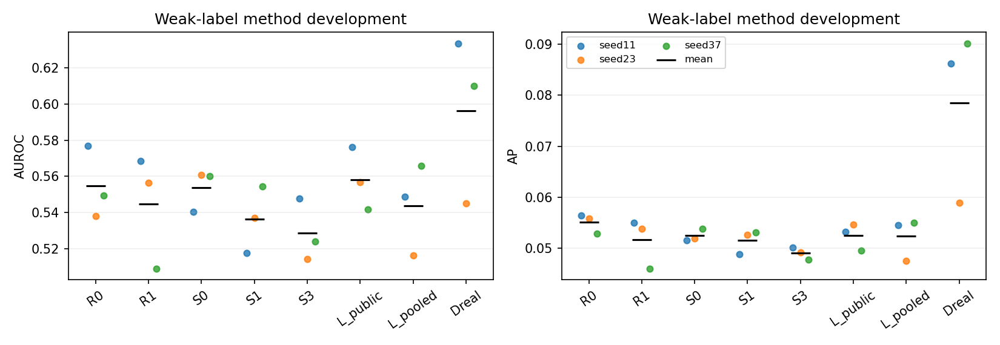
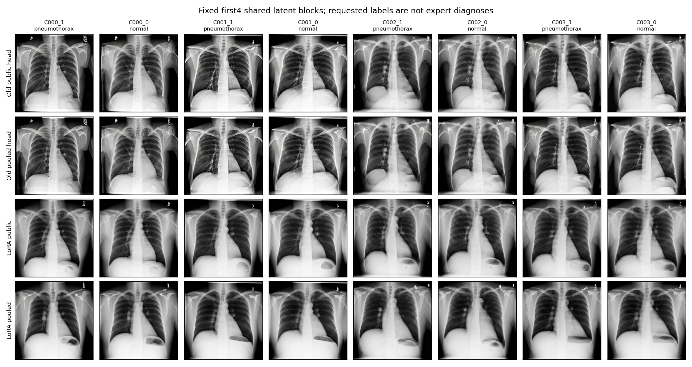
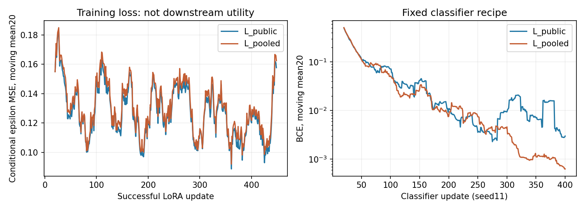

# 기존 LoRA 공개전용 대 공개+사적 대조: 실제 실행 결과

2026-09-17 KST. **방법 효용에는 음성 결과다. 실행 연결과 검산은 통과했지만, 이 고정 LoRA 구성도 사적 추가 합성 효용 관문을 통과하지 못했다.**

L_public의 개발 AUROC는 **0.558234**, L_pooled는 **0.543587**이다. 사적 자료를 추가한 차이는 **−0.014647**, 우세한 classifier seed는 **1/3**이었다. R0·R1 대비 기준도 미통과다. 이 결과는 고정448-update LoRA·방법당128장·현재 분류기 조합에 대한 개발 판단이며, LoRA 전체나 사적 자료의 일반적 무효를 뜻하지 않는다.

두 LoRA 학습, 256장 생성, 6개 분류기 학습과 개발 평가를 실제로 완료했다. **새 DP 실행0, expert final532명·reserved4213명 접근0, final_ready=false**를 유지한다. 기존 full64 종료 기록은 바꾸지 않는다.

## 1. 고정한 비교와 실행 범위

[사전 계획](TRACK1_LORA_TRANSFER_COMPARISON_PROTOCOL_20260917.md)과 [계획 JSON](spec_sources/lora_transfer_comparison_plan_20260917.json)을 그대로 사용했다. 계획 JSON의 `runtime_implemented=false` 등은 계획을 동결했던 시점의 기록이며, 현재 실행 상태는 본 보고서와 새 실행 계약으로 구분한다.

| 항목 | L_public | L_pooled |
|---|---:|---:|
| 추가 적응 환자·영상 | 공개32명·64장 | 공개32명·64장 + 사적80명·320장 |
| 성공 optimizer update | 448 | 448 |
| batch·총 영상 제시 | 4·1,792회 | 4·1,792회 |
| 공개 영상당 노출 | 28회 | 8회 |
| 사적 영상당 노출 | 0회 | 4회 |
| 환자당 노출 | 56회 | 모든 환자16회 |
| AMP 생략 시도 | 0 | 0 |
| 새 생성물 | 128장 | 128장 |
| 분류기 학습 | 3seed ×400step | 3seed ×400step |

두 arm은 SHA `7bc5ce421cc02091e8c3812676e9c27dc58330afce5e9384abd8edc9f61a3b91`의 E4에서 각각 시작했다. 기존 rank8/alpha8 A/B 1,659,904개 parameter를 이어 학습했고 새 adapter를 추가하거나 B를 0으로 초기화하지 않았다. AdamW·GradScaler는 arm마다 새로 만들었다. 각 arm의 A/B tensor256개가 실제 변경됐으며, 원 UNet parameter hash는 전후 동일했다.

조건부 epsilon MSE, lr1e-4, batch4, norm cap1, FP16 base/autocast 및 FP32 LoRA/loss를 유지했다. 224-step snapshot은 진단용으로 저장했지만 생성에는 **448-step 최종본만** 사용했다. 성공 update는 GradScaler scale 변화뿐 아니라 optimizer post-hook과 AdamW 내부 step counter로 확인했다.

이는 같은 update 예산에서 공개자료를 더 반복하는 구성과 더 많은 사적 역할 환자를 포함하는 구성의 비교다. 추가 환자·영상 다양성, 기흉 support, 공개영상 반복 감소를 각각 분리한 대조가 아니다. 또한 LoRA는 조건부 noise loss로 학습하고 생성의 양 branch에 영향을 준다. CFG-aware guided residual을 회귀한 기존 head와의 차이를 parameter 수 하나의 인과 효과로 해석하지 않는다.

## 2. 실행 연결 관문

| 검사 | 실제 확인 |
|---|---|
| E4 초기 복원 | 두 독립 로드에서 과거 backbone의 모든 DDIM 배열·최종 출력 exact; 추가 decode2회 |
| cache 경계 | 선택384장만 새로 생성; public64/private320 분리. L_public 학습은 public cache 하나만 읽음 |
| 공통 학습 입력 | 실제 noise·timestep448묶음 일치, 공통 공개512slot의 image/patient 대응 일치 |
| frozen base | 두 학습 모두 비LoRA UNet parameter hash 불변 |
| 생성 연결 | full64 hook 없음; 동일 실제 latent·conditional/null 입력; FP32·CFG7.5·DDIM30·eta0·256 유지 |
| 기존 classifier parity | 원 S1의 선택 ID·GPU 입력·logit·loss·최종 state exact |
| 새 classifier source | 실제 raw/PNG→array→GPU 입력 확인; 새 두 arm 각각1step×2 exact replay |
| 전체 draw 대응 | 2,400개 배치의 공개영상 stream 및 synthetic cell·요청 label이 과거 S1과 일치 |

분류기 연결 검증에는 별도 **6 update**를 사용했다. 본 학습은 별도의 **2,400 update**다. 각 새 one-step run에서 trainable tensor62개가 변경됐다. 추가 독립 코드가 실제43개 선택 파일에서 새 두 arm의 GPU 입력을 재구성했고, 네 replay 입력 모두 exact였다.

[새 runner](../../code_working/lora_transfer/run.py)는 legacy `data`/`train` import를 차단한다. 기존 `data_v2.py`·`train_v2.py`는 수정하지 않았다. 새 공급자만 임시 연결하고 `finally`에서 복구한다. 계약과 완료 marker는 source와 산출물을 SHA로 결속하며, 부분 실행을 조용히 덮어쓰거나 재시작하지 않는다.

계약 생성 전 metadata 점검에서 기존 명부의 사적 역할명이 `split=train`임을 확인해 `train→private` 대응을 명시했다. 이때 계약·모델 실행·산출물은 아직 없었다. NumPy1.26의 `trapz` 호환성도 계약 전에 반영했다. 계약 동결 뒤에는 과학 계산 source 변경, 학습 재시작, 생성물 교체가 없었다.

## 3. 개발 효용 결과

R0/R1/S0–S3/Dreal은 byte 결속과 kernel parity를 확인한 과거 결과다. 새로 학습한 것은 L_public/L_pooled의 6run뿐이다. R1 calibration을 다시 선택하지 않았으며 기존 lr1e-4·400step, ImageNet ResNet18, seed11/23/37을 그대로 사용했다.

평가는 기존 method-development **2,026명·5,047장**, weak 기흉 양성223장이다. 각 seed의 metric을 계산한 뒤 평균했다. 같은 개발 환자와 생성 latent를 재사용한 후속 개발 비교이며 새 독립 확인이 아니다.

| Arm | 평균 AUROC | 평균 AP |
|---|---:|---:|
| R0 — 공개 실자료 | 0.554745 | 0.055087 |
| R1 — 공개 실자료·기본 증강 | 0.544610 | 0.051669 |
| S0 — backbone 합성 | 0.553782 | 0.052479 |
| S1 — public head 합성 | 0.536259 | 0.051542 |
| S2 — private-only head 합성 | 0.549112 | 0.052830 |
| S3 — pooled head 합성 | 0.528546 | 0.049065 |
| **L_public — 공개전용 LoRA 합성** | **0.558234** | **0.052515** |
| **L_pooled — 공개+사적 LoRA 합성** | **0.543587** | **0.052384** |
| Dreal — 사적 실자료 직접 사용 | 0.596172 | 0.078445 |

| L_pooled의 비교 대상 | AUROC 차이 | 우세 seed | AP 차이 | 사전 관문 |
|---|---:|---:|---:|---|
| L_public | −0.014647 | 1/3 | −0.000131 | 미통과 |
| R0 | −0.011157 | 1/3 | −0.002704 | 미통과 |
| R1 | −0.001022 | 1/3 | +0.000715 | 미통과 |

세 비교 모두 평균 AUROC≥+0.01, 양의 seed≥2/3, 평균 AP 비감소를 만족해야 하는 사전 engineering gate는 **false**다. 이 기준은 투자 판단용이며 임상적 최소차이나 통계 법칙이 아니다.

| classifier seed | L_public AUROC | L_pooled AUROC | pooled−public |
|---|---:|---:|---:|
| 11 | 0.576229 | 0.548683 | −0.027545 |
| 23 | 0.556870 | 0.516368 | −0.040501 |
| 37 | 0.541605 | 0.565710 | +0.024105 |

Seed37의 양의 차이만 골라 성공으로 바꾸지 않는다. 세 seed는 분류기 학습 반복이며, LoRA 학습 세 번이나 생성 bank 세 개가 아니다.

## 4. 불확실성과 기존 head 비교

환자를 재표집하고 그 환자의 모든 영상을 함께 포함하는 paired cluster bootstrap2,000회를 사용했다. 모든 arm에 같은 patient draw를 적용했고 각 draw에서도 seed별 metric을 먼저 계산한 뒤 평균했다. 아래는 고정된 생성기·bank·학습 모델에 조건부인 개발 구간이다.

| AUROC 차이 | 점추정 | 95% percentile 구간 |
|---|---:|---|
| L_pooled−L_public | −0.014647 | [−0.049878, +0.022601] |
| L_pooled−R0 | −0.011157 | [−0.049994, +0.030779] |
| L_pooled−R1 | −0.001022 | [−0.038648, +0.037894] |
| L_public−S1 | +0.021975 | [−0.018071, +0.062525] |
| L_pooled−S3 | +0.015041 | [−0.023709, +0.052056] |

LoRA 두 arm은 각자의 과거 head보다 평균 AUROC가 높았다. 그러나 둘 사이의 사적 추가 효과는 음수였고, head 대비 차이의 구간도 0을 포함한다. **LoRA가 head보다 좋다는 확증이나 사적 추가 효용으로 읽을 수 없다.** L_public도 R0보다 평균 +0.003490에 그쳤고 AP는 더 낮아, 공개 LoRA 합성이 실자료 기준을 확실하게 개선했다고 주장하지 않는다.

기존 head의 pooled−public은 −0.007713, 이번 LoRA는 −0.014647이며 두 차이의 차이는 −0.006934다. 이 interaction의 95% 구간은 [−0.045561, +0.034498]이다. 이는 기술적 비교이고 용량 차이의 인과 추정이 아니다.

이번 관문 미통과와 함께 유지해야 할 한계는 단일 LoRA 학습·단일 bank, 낮은 절대 downstream 성능, weak-label 개발 평가, public positive6장의 반복 노출, 실자료 절반을 합성으로 대체하는 fixed-compute 학습이다. 실패 원인을 head/LoRA 표현력·목표·라벨 fidelity·bank 규모·분류기·배합 중 하나로 분리하지 못했다. 사적 자료가 해롭거나 효과가 정확히0임을 증명한 결과도 아니다.

## 5. 생성물과 학습 기록

첫4개 latent block, 각 기흉/normal 요청, 과거 두 head와 새 두 LoRA의32장을 순서대로 표시했다. 품질로 고른 subset이 아니다. 이 제한된 예시에서는 LoRA 출력이 더 매끈해 보이고 기흉/normal 요청 간 구도가 비슷하다. 이는 직접 확인한 개발 표시 예시의 질감 관찰이며, 전문의 판독·질환 정확성·전체256장 품질 판정이나 실패 원인 증명이 아니다. 이 초기4block에는 effusion/cardiomegaly 요청이 없다.

학습 loss는 실행 상태를 설명하는 보조 기록이다. checkpoint 선택이나 진행 판단에 사용하지 않았다. LoRA의 서로 다른 학습자료에서의 loss 차이를 동일 분포의 성능 비교로 해석하지 않는다.

원본256장과 전체 trajectory는 로컬 `_reports/lora_transfer_20260917_v1`에 보존한다. [공개 가능한256cell 명부·SHA](spec_sources/lora_transfer_generation_manifest_20260917.json)와 위 검토용 grid를 별도로 남겼다. 위 grid는 원본256장 전체가 아니다.

## 6. 실측 비용과 검산 범위

| 실제 계산 | 시간 |
|---|---:|
| 선택384장 latent/text cache | 28.15초 |
| 두 LoRA 학습896update | 460.65초, 약7분41초 |
| 256장 순수 생성 | 695.25초, 약11분35초 |
| 생성 trace·PNG 저장 | 79.15초 |
| 분류기6run·2,400update | 346.98초, 약5분47초 |
| 개발 실영상 예측6run | 19.91초 |

추가2decode·6update 연결 검사, source SHA 검사, 모델 로딩, 독립 검산, 코드 구현·문서 작성은 위 계산 합계와 별도다. 런타임 계약12:20:28 UTC 이후 본 단계와 독립 검산을12:55:28 UTC에 마쳤다. 이 약35분은 구현·최종 보고 전체 작업시간이 아니다. RTX3070 peak allocated는 학습1.931GiB, 생성3.930GiB, 분류기0.923GiB였다.

별도 saved-artifact 검산 **46,849항목**이 통과했다. 7,680개 DDIM 전이의 최대 차이는9.54e−7, CFG 재계산 차이0, BCE 최대 차이9.39e−8, AUROC/AP 최대 차이1.11e−16이었다. 새 LoRA 입력43파일의 독립 GPU 전처리도 exact였다. Bootstrap2,000회는 독립 검산기의 고정 산술로 계산했고, 첫10개 고정 patient draw×27개 모델을 sklearn의 가중 metric과 추가 대조해 최대1.11e−16을 확인했다. 전 bootstrap을 두 구현으로 모두 재계산했다는 뜻은 아니다.

이는 코드·수치 무결성 검증이며 외부 임상 판독이나 성능 표본 수가 아니다. 분류기 실자료는 기존 검증된224 cache를 재결속해 사용했고, 새 raw SHA·전처리 전체 재구축은 LoRA 선택384장과 입력 replay에 필요한 공개 파일 범위다. 원본 실자료11,277장 전체를 이번에 다시 decode했다고 주장하지 않는다.

## 7. 판단과 다음 경계

이번에 비어 있던 비교를 실제로 채웠다. **현재 고정 LoRA 구성에서도 같은 사적 자료의 반복 가능한 추가 합성 효용은 확인하지 못했다.** 따라서 이 실행으로 DP 확대나 expert final 개방을 정당화할 수 없다.

기존 full64 분기와 이번448-update LoRA 결과를 그대로 보존한다. Checkpoint·prompt·seed·영상 수·head scale·gate를 바꿔 이번 결과를 구제하지 않는다. 세 번째 adapter 순회, 새 알고리즘 개발, 다른 주제 전환 중 어느 것도 자동으로 선택하지 않는다. 후속 투자가 필요하다면 두 적응 방식에 공통인 생성자료 사용·분류기·측정 조건 중 근거 있는 불확실성 하나를 먼저 검토할지 별도로 판단한다. 이 보고서는 그 원인이나 해결책까지 확정하지 않는다.

**현재 결론:** 실행 가능한 기존 방법 대조를 완료했으나 사적 합성 효용은 여전히 미확보다. Expert final과 reserved는 보존됐고, 현재 CVPR privacy 핵심 주장을 세울 새 양성 결과는 추가되지 않았다.

## 근거 파일

- [집계·검산·비용 실행 기록](spec_sources/lora_transfer_execution_record_20260917.json)
- [새 실행 코드와 안전 경계](../../code_working/lora_transfer/README.md)
- [실행 계약](../../code_working/_reports/lora_transfer_20260917_v1/contract.json)
- [원 결과](../../code_working/_reports/lora_transfer_20260917_v1/result.json) · [별도 산술 검산](../../code_working/_reports/lora_transfer_20260917_v1/verification.json)
- [입력·bootstrap 추가 검산 코드](verify_lora_transfer_inputs_20260917.py)
- [보고서·상태·과거 source 결속 검증 코드](verify_lora_transfer_report_20260917.py)
- [기존 full64 결과](TRACK1_DOWNSTREAM_DEVELOPMENT_RESULTS_20260917.md) · [기존 종료 판단](TRACK1_CURRENT_HEAD_BRANCH_CLOSURE_20260917.md)
