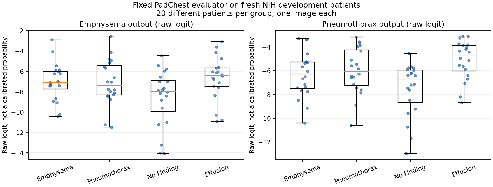

# 방향1: PadChest 평가기 실제 NIH 검증 결과

**판정: 나쁜 결과다. 고정 PadChest 평가기는 이번 NIH 폐기종·기흉의 조건특이적 생성 효용을 판정할 개발 관문을 통과하지 못했다.** 코드/전처리/통계 검산은 통과했지만, 새 검증군에서 두 target의 one-versus-rest AUC가 모두 **0.5308**이다. 이 결과는 private adaptation 방법의 실패가 아니라 **현재 평가기 후보의 부적합**이다. 작은 head의 targeted 생성 효용과 patient-DP는 아직 판단하지 않았다.

2026-09-17 실제 실행. 큰 단계2·방향1. [추론 전 고정 명세](TRACK1_PADCHEST_VALIDATION_PROTOCOL_20260917.md) · [직전 사용 이력 감사](TRACK1_PATIENT_USAGE_AUDIT_RESULTS_20260917.md). 예상20–35분으로 시작했고 아래 실측은 프로그램 실행 시간이다. 새 생성·학습·DP는0이다.

## 1. 준비에서 끝내지 않고 무엇을 실행했는가

**309명·309장의 실제 NIH PA 영상**을 해시·디코딩하고, 고정 `densenet121-res224-pc`를 RTX3070에서 실행했다. 환자당1장이다. 모델을 비교해 가장 좋은 것을 고르거나 score를 보고 환자/영상/전처리를 변경하지 않았다.

|Stratum|폐기종-only|기흉-only|No Finding|target-free Effusion|Dual-secondary|합계|
|---|---:|---:|---:|---:|---:|---:|
|기존 비잠금 evaluator 자료|4|34|95|85|11|229|
|새 target-development evaluator 전용|20|20|20|20|0|80|

기존 폐기종15명 중11명은 기흉도 있어 단독군이4명뿐이었다. 이것은 **score 확인 전 metadata에서 확인**했고, 부족한 support 때문에 새 development의 군별20명을 hash로 골라 주 검증군으로 고정했다. 결과가 나빠서 환자를 추가한 것이 아니다. 새로운80명과 기존229명은 별도 stratum으로 보고하며 좋은 쪽만 선택하지 않는다.

환자군은 현재 보유 PA 영상의 label 합집합으로 상호배타적으로 정했다. E-only/P-only는 상대 target이 없다는 뜻이며, 다른 질환이 전혀 없는 환자라는 뜻은 아니다. No Finding/Effusion control도 같은 환자의 다른 보유 영상에 target이 있으면 제외했다. 이후 해당군 label을 가진 영상 중 hash 최솟값1장을 사용했다. Dual11명은 primary 판정에 넣지 않았다. NIH weak label의 부재를 임상적으로 확정된 질환 부재라고 부르지 않는다.

## 2. 주 검증군80명 — 두 조건 모두 미통과

|출력 / 양성군|대조군|양성/음성 환자|AUC (95% bootstrap)|AP / prevalence|
|---|---|---:|---:|---:|
|Emphysema|나머지 세 군|20/60|0.5308 (0.3925–0.6675)|0.2827 / 0.2500|
|Emphysema|상대 target|20/20|0.5025 (0.3199–0.6875)|0.5087 / 0.5000|
|Emphysema|No Finding|20/20|0.6525 (0.4775–0.8151)|0.6461 / 0.5000|
|Emphysema|target-free Effusion|20/20|0.4375 (0.2550–0.6200)|0.4968 / 0.5000|
|Pneumothorax|나머지 세 군|20/60|0.5308 (0.3841–0.6808)|0.2862 / 0.2500|
|Pneumothorax|상대 target|20/20|0.5425 (0.3650–0.7175)|0.5628 / 0.5000|
|Pneumothorax|No Finding|20/20|0.6800 (0.5050–0.8275)|0.7504 / 0.5000|
|Pneumothorax|target-free Effusion|20/20|0.3700 (0.2125–0.5501)|0.4420 / 0.5000|

사전 운영 기준은 target 대 나머지군 AUC≥0.70/95%하한>0.50, 상대 target 대조 AUC≥0.60/95%하한>0.50을 **각 질환 모두** 만족하는 것이다. 두 질환 모두 두 항목을 만족하지 못했다. 평균값도 기준과 거리가 있어, 단순히 엄격한 신뢰구간 때문에 탈락한 결과가 아니다.

특히 폐기종과 기흉을 서로 구분하는 AUC는0.5025/0.5425이고, 흉수와 구분하는 AUC는0.4375/0.3700이다. 정상 대조에선0.6525/0.6800으로 더 높다. 즉 이 자료에서 점수가 일부 일반적 비정상 소견을 반영할 수는 있어도, 우리가 필요한 target-specific 판별력이 확인되지 않았다. **생성물의 이 점수만 올라갔다고 해당 target이 더 잘 표현됐다고 해석할 수 없다.**

[점수 분포 PDF](assets/padchest_validation_scores_20260917.pdf). 점은 독립 환자1명이다. 두 출력의 logit 절대값은 서로 교정된 scale이 아니므로 질환 간 값 자체를 비교하는 그림이 아니다.

## 3. 기존 공개자료 결과도 함께 남긴다

|출력 / 양성군|대조군|양성/음성 환자|AUC (95% bootstrap)|AP / prevalence|
|---|---|---:|---:|---:|
|Emphysema|나머지 세 군|4/214|0.6822 (0.5140–0.8773)|0.0657 / 0.0183|
|Emphysema|상대 target|4/34|0.5294 (0.2721–0.8235)|0.1766 / 0.1053|
|Emphysema|No Finding|4/95|0.7816 (0.6316–0.9158)|0.1380 / 0.0404|
|Emphysema|target-free Effusion|4/85|0.6324 (0.4118–0.8735)|0.2996 / 0.0449|
|Pneumothorax|나머지 세 군|34/184|0.5665 (0.4704–0.6629)|0.1779 / 0.1560|
|Pneumothorax|상대 target|34/4|0.3897 (0.0588–0.7574)|0.8597 / 0.8947|
|Pneumothorax|No Finding|34/95|0.7170 (0.6161–0.8105)|0.4929 / 0.2636|
|Pneumothorax|target-free Effusion|34/85|0.4066 (0.2997–0.5145)|0.2395 / 0.2857|

기존군은 모델/metric 개발 등에 이미 소비된 공개자료다. 폐기종 양성4명은 특히 작아 구간 해석이 불안정하다. 일부 정상 대조 수치가 좋다고 새80명의 결과를 대신하지 않는다. 기존군에서도 기흉 대 흉수0.4066으로 조건특이성 문제와 같은 방향이다. 이는 원인을 확정하는 독립 외부기관 재현은 아니다.

AP는 stratum과 대조군의 양성 비율에 의존한다. 예를 들어 기존 기흉 대 폐기종의 AP0.8597은 prevalence0.8947보다 낮고, 높은 AP 숫자만으로 좋은 평가기라고 할 수 없다. 모든 표에 prevalence를 같이 적었다. Bootstrap은 군별 환자를 복원추출해 크기를 유지한2,000회, percentile95%구간이며 다중 비교 조정이나 임상 power 보장은 없다.

## 4. 실행 오류나 출력 해석 오류인가

현재 확인 범위에서는 그 근거를 찾지 못했다.

- 설치 소스와 checkpoint SHA, PyTorch/XRV/resize 등 버전을 추론 전에 결속했다. PC checkpoint의 두 출력은 학습된 slot이며 Emphysema5/Pneumothorax3 index를 확인했다. NIH/all 모델은 실행하지 않았다.
- 8bit grayscale → 공식 normalize[-1024,1024] → center crop → skimage224 resize를 실행했다. 독립 코드가309장 전체의 pixel에서 tensor를 재계산했고 exact equality였다.
- 주 점수는 classifier의 raw logit이다. 기본 forward의 sigmoid+op_norm을 별도로 재계산했고 일치했다. 미학습 slot의0.5 출력을 target 점수로 쓰지 않았다.
- 고정4개 입력의 batch/replay raw logit 최대 차이는0이었다. 모델의 전체 추론을 별도 구현으로 재현했다는 뜻은 아니다.
- 독립 코드는 생산 metric 함수를 import하지 않고 pair-count AUC와 threshold-block AP,32,000개 bootstrap AUC/AP 쌍을 전부 재계산했다. 최대 차이 **3.33e-16**이다.
- 선택 환자/영상 hash 규칙, 전체 local inventory의 cross-patient exact duplicate 부재, 공식 metadata·환자·label, 원본 파일 SHA를 확인했다. Near-duplicate 임상 판정은 하지 않았다.

독립 검산 **34,805항목 PASS**는 위 무결성 확인 수이며 성능 표본 수가 아니다. 평가기 판별력은 새80명에서 본 결과 그대로 나쁘다. 가능한 원인에는 PadChest→NIH 분포 차이, weak-label 정의/동반질환 차이, 비특이적 특징 의존 등이 있지만 이번 실험은 이를 인과적으로 분리하지 않았다.

## 5. 실제 비용과 보존 상태

|실측|값|
|---|---:|
|실제 validation 프로그램 전체|30.951초|
|그 중 GPU 추론·4입력 replay|1.191초|
|주 forward + replay|22회 / 317 image-examples|
|측정 peak allocated GPU memory|0.159GiB|
|독립 검산|20.765초|
|새 generator forward / backward / 생성 / DP|0 / 0 / 0 / 0|

메모리는 PyTorch allocated 값이며 전체 프로세스 reserved/시스템 GPU 사용량을 뜻하지 않는다. 추론1.19초는 package 전체 작업시간과 다르다. Pandas optional accelerator 버전 warning은 있었으나 이 실행의 CSV/통계는 stdlib/NumPy/Scikit-learn 경로로 완료됐고 환경을 바꾸지 않았다.

새 evaluator80명은 이제 **평가 결과를 소비한 환자**다. 직전 감사의 D등급은 당시 상태의 역사적 기록으로 남기고, `evaluator_exclusions_private.csv`를 현재 추가 사용 이력으로 결속했다. 이들을 이후 생성 reference/confirmation에 재사용하지 않는다. 나머지 development4,133명 중 상호배타적 폐기종64명·기흉197명·No Finding2,152명·Effusion774명, dual51명·기타895명이 남는다.

Reserved confirmation4,213명은 새 이미지 접근·추론·tuning에 쓰지 않았다. 명부상의 ID 교집합만 확인했다. 졸논 final/test와 원본 분할, 고정 backbone/head, 과거192장 생성물과 당시 private 효용 미통과 판정, 과거 E4/CFG1 실패 adoption 모두 보존했다. 미래 졸논 모델이 candidate 환자를 학습하면 독립 reference로 쓸 수 없다는 기존 조건도 유지한다.

## 6. 다음 판단 — 자료는 있지만 신뢰할 조건 평가기가 없다

이번 작업은 평가기 검증까지 **실제로 완료**했다. 새 데이터 부족 문제는 다시 생기지 않았다. 현재 병목은 두 조건의 생성 효용을 판정할 수 있는 측정 방법이다. Private 생성이 유용한지/무용한지는 여전히 미확인이다.

다음은 **20–30분의 평가방법 재설계 검토 한 번**이다. 필요한 것은 여러 classifier를 돌려 좋은 점수를 고르는 일이 아니라, 두 조건의 label 정의·학습 출처·NIH overlap과 검증 근거를 확인해 현재 문제에 맞는 대안 한 후보를 정당화할 수 있는지 판단하는 것이다. 후보가 정당화되면 새 명세 아래 개발용 검증을 하고, 기존80명은 평가기 선택에 이미 사용된 자료로 명시해야 한다. Reserved confirmation은 그 선택에 사용하지 않는다.

대안이 없으면 RAD-DINO KID나 raw text cosine만으로 target-specific private 효용이 성공했다고 판정하지 않는다. 임상 판독 자원/독립 자료/문제 설정을 재검토해야 한다. 조건 민감한 평가 근거를 확보하기 전에는 targeted 생성 확대·residual solver·patient-DP로 넘어가지 않는다. 현재 실패는 평가기 후보 하나의 실패이며 patient-private adaptation 전체의 반증은 아니다.

## 7. 재현 파일

로컬 실행 폴더: `code_working/_reports/padchest_validation_20260917_v1`.

- `contract.json` / `selected_images_private.csv`: score 전 코드·source·환자·영상 고정.
- `normalized_inputs.npy` / `image_audit.json` / `logits.npy` / `forward_replay.npz`: 실제 입력/출력.
- `metrics.json` / `bootstrap.npz` / `result.json` / `verification.json`: 전 결과와 독립 계산.
- `evaluator_exclusions_private.csv` / `remaining_development_private.csv`: 새 소비 이력 및 잔여 후보.
- Contract SHA: `f93556a5fa8972947b915223a298628ef7cc24549c07c49be914fdebdb2322eb`.
- Result SHA: `71b3be4cf28acbf23e826479687729d9680f9cba2931250c50e963e98e95840e`.
- Metrics SHA: `578f548157b7c932e5a47ef71e3d88a3dc61afef7b6b2af0a5a5dfb1766d99ff`.

원격 main 확인이나 push는 이 검증 범위에 포함하지 않았다. 보고서는 로컬 실제 실행과 기록에 근거한다.
