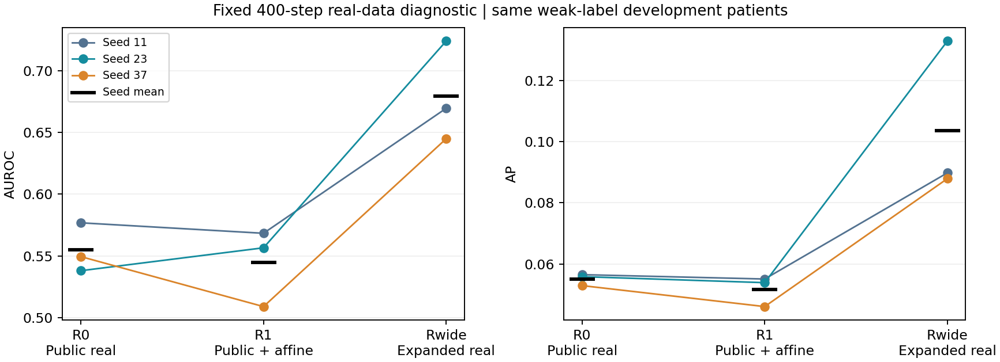

# 실환자 학습 범위 확대: 고정 분류기 개발 대조 결과

2026-09-17. **실자료 범위 대조에는 긍정적이다.** Rwide는 같은 ResNet18·400 step에서 R1 대비 평균 AUROC +0.134825, AP +0.051872, AUROC 우세 3/3 seed로 개선 후보 기준을 통과했다. 이는 추가 실자료에 직접 접근한 **비DP 일반화 진단**이며, 기존 private synthetic 효용 실패를 취소하거나 DP 진입을 허용하는 결과가 아니다.

[실행 전 명세](TRACK1_REAL_SUPPORT_DIAGNOSTIC_PROTOCOL_20260917.md) · [계획 검토](TRACK1_REAL_SUPPORT_DIAGNOSTIC_PLAN_REVIEW_20260917.md) · [전체 수치](spec_sources/real_support_diagnostic_record_20260917.json) · [seed별 CSV](spec_sources/real_support_diagnostic_scores_20260917.csv) · [실행 검산](spec_sources/real_support_diagnostic_execution_verification_20260917.json) · [4-update 독립 검산](spec_sources/real_support_diagnostic_probe_verification_20260917.json).

## 무엇을 실제로 바꿨는가

기존 public672명·813장(기흉 양성6명·6장)에 former-classifier-selection2027명·5097장(양성114명·230장) 전체를 더했다. 허용 pool은2699명·5910장, 양성120명·236장이다. Private80은 포함하지 않았다. 추가 자료의 original private_train 출처와 과거 R1 calibration 소비를 유지한다. 이 모델은 확대 공개 baseline이나 privacy-preserving arm이 아니다.

두 half-batch 모두 합친 pool에서 image label별 patient-uniform → image-uniform로 추출했다. 앞16장을 public으로 고정하지 않았다. ImageNet 초기화·ResNet18·224letterbox·affine·FP32·AdamW(lr1e-4,wd1e-4)·400step·batch32·seed11/23/37은 동일하다. 각 seed의 전체 제시12,800회, 양성6,400회도 같다. 변경된 pool은 환자/양성 다양성, 반복, 동반소견, 출처 구성 등을 함께 바꾼다. 반복 감소나 양성6명만의 인과 효과를 분리한 실험이 아니다.

## 같은 개발 환자에서의 결과

평가는 기존 method-development2026명·5047장(양성223장)의 영상별 weak label이다. 반복 사용한 개발자료이며 독립 confirmation이 아니다. 아래는 **seed별 metric을 계산한 뒤 평균**이며 점수 ensemble 성능이 아니다.

| Arm | 평균 AUROC | 평균 AP | 평균 BCE |
|---|---:|---:|---:|
| R0 | 0.554745 | 0.055087 | 0.400543 |
| R1 | 0.544610 | 0.051669 | 0.418000 |
| Rwide | 0.679434 | 0.103542 | 0.323920 |

| Seed | R1 AUROC | Rwide AUROC | 차이 | Rwide AP |
|---|---:|---:|---:|---:|
| 11 | 0.568315 | 0.669503 | +0.101188 | 0.089795 |
| 23 | 0.556552 | 0.723952 | +0.167400 | 0.132923 |
| 37 | 0.508962 | 0.644848 | +0.135886 | 0.087907 |

- Primary Rwide−R1: AUROC +0.134825, 95% paired patient-cluster 구간 [+0.084156, +0.187751]; AP +0.051872, 구간 [+0.028307, +0.083231].
- Secondary Rwide−R0: AUROC +0.124690, 구간 [+0.069864, +0.177290]; AP +0.048454, 구간 [+0.024105, +0.078128].
- 사전 기준은 R1 대비 평균 AUROC ≥+0.01, 양의 차이 ≥2/3seed, 평균 AP 비감소다. 판정은 **개선 후보 기준을 통과했다**. 절대 성능의 충분성이나 임상 유의성에 관한 기준은 아니다. R0는 사전 secondary이며 유리한 비교만 선택하지 않았다.
- 기존 Dreal 평균 AUROC0.596172/AP0.078445는 다른 자료 접근의 참고값이며, 이번 primary 대조나 수학적 상한이 아니다.

기존 저장 patient_counts2000개를 그대로 재사용했다. 동일 환자의 모든 영상과 재표집 배수를 모든 arm/seed에 같이 적용했다. 구간은 현재 학습된 모델과 자료에 조건부인 개발 기술 통계다. Patient bootstrap은 새로운 환자 cohort나 새로운 학습 seed를 만드는 절차가 아니다.

## 학습자료와 개발자료의 차이

해당 seed에서 실제 한 번 이상 학습한 고유영상만, 증강 없이 eval()/inference_mode()에서 측정했다. 학습하지 않은 허용 pool 영상은 아래 학습 metric에서 제외했다. Parameter와 BatchNorm buffer는 추론 전후 불변이며 다시 맞추지 않았다.

| Seed | 실자료 출처 | 실제 본 고유영상 | 학습 AUROC | 학습 AP | 평가 모드 BCE |
|---|---|---:|---:|---:|---:|
| 11 | all_seen | 3439 | 0.999340 | 0.991734 | 0.018940 |
| 11 | public | 658 | 1.000000 | 1.000000 | 0.006608 |
| 11 | classifier_selection | 2781 | 0.999213 | 0.991768 | 0.021858 |
| 23 | all_seen | 3459 | 0.998759 | 0.982596 | 0.057302 |
| 23 | public | 682 | 0.999753 | 0.976190 | 0.031986 |
| 23 | classifier_selection | 2777 | 0.998537 | 0.983071 | 0.063520 |
| 37 | all_seen | 3476 | 0.996690 | 0.963482 | 0.158302 |
| 37 | public | 666 | 1.000000 | 1.000000 | 0.112431 |
| 37 | classifier_selection | 2810 | 0.996136 | 0.963305 | 0.169175 |

| Arm | 개발 음성 평균 logit | 개발 양성 평균 logit | 개발 양성 BCE |
|---|---:|---:|---:|
| R1 | -9.565023 | -9.454965 | 9.455126 |
| Rwide | -5.833602 | -3.703595 | 4.180947 |

학습 로그의 마지막50step BCE, 고유영상 BCE, 노출 가중 BCE는 입력·증강·가중치가 다른 값이다. 서로 같아야 하는 것은 아니다. 학습 성능만 낮아져도 train–development 차이는 줄 수 있으므로, 판정은 개발 성능의 실제 개선에 근거한다. Threshold를 변경하거나 개발영상으로 BN을 보정하지 않았다.

Rwide 마지막50step의 평균 학습 BCE는 seed11/23/37에서 각각 0.051189 / 0.046956 / 0.045872다. 전체400step 로그와 각 step의 실제 추출 이력은 checkpoint와 함께 보존했다.

이번 Rwide의 실제 본 학습영상 AUROC는 0.996690–0.999340이고, 개발 AUROC는 seed별 0.644848–0.723952다. 학습자료 판별력은 여전히 매우 높으며 개발 일반화 차이는 남아 있다. 개발 양성 점수도 평균적으로 음의 logit에 머문다. 따라서 이번 개선을 일반화 문제의 완전한 해결이나 임상적 사용 가능성으로 확대하지 않는다.

## 실제 노출과 역할 소비

| Seed | 실제 환자 | 실제 고유영상 | 기존 public 양성6장 제시 합 | 해당 영상당 최소–최대 | 중앙값 |
|---|---:|---:|---:|---:|---:|
| 11 | 2466 | 3439 | 327 | 47–62 | 54 |
| 23 | 2468 | 3459 | 325 | 45–61 | 54 |
| 37 | 2472 | 3476 | 316 | 48–58 | 52.5 |

각 seed는 양성120명·236장 전체를 사용했다. 허용5910장 전체를 각 run에서 다 학습했다는 뜻은 아니다. 원 R1의 양성6장 반복은 영상당1025–1113회였고, 이번 실제 범위는45–62회다. 같은 양성6400회가 더 많은 환자·영상에 배분됐다. Class별·source별·환자별·영상별 count는 로컬 trace와 exposure CSV, 공개 JSON 집계에 결속했다.

2027명 전체를 이 분기의 학습 자원으로 관리하고, 그중 실제 optimizer에 등장한 환자는 세 seed 합집합 2026명이다. 별도 consumed overlay에 실제 횟수를 기록했다. 원 역할표와 과거 calibration 기록은 수정하지 않았다. 해당 환자를 이 분기의 미사용 validation으로 재사용하지 않는다.

## 실행과 검산

계약과 소스를 모델 실행 전에 동결했다. 기존 data_v2/train_v2는 변경하지 않았고 legacy import를 차단했다. 공급자는 연결 구간 밖에서 원래 함수로 복원된다. 원본·bytes·decode·224cache10957장 전체를 검사한 뒤 다음 순서로 실행했다.

1. 원 R1 1step와 public-only를 넣은 새 공급자1step가 선택ID·실제GPU입력·logit·loss·최종state까지 exact.
2. Rwide1step를 같은 초기상태에서 두 번 실행해 동일 항목 exact. 네 run 모두 실제 trainable tensor62개 변경, finite loss/gradient, 새 AdamW.
3. 독립 raw→GPU 입력 재계산 통과 뒤, probe 가중치를 버리고 각 seed의 과거 동일 ImageNet 초기화에서400step씩, 총1200update 실행. 최종 모델3개를 모두 고정한 뒤 평가.
4. 원 R1 평가 경로는 고정 개발64장×3모델=192건을 재추론해 기존 raw logit과 exact. 192개 고유영상이 아니다.
5. 실제 trace1200batch·38400slot을 독립 sampler와 사전 일정에 대조. 원본10957장 전체를 독립 디코딩해 cache와 다시 일치 확인. AUROC/AP와2000draw×3arm×3seed=18000개 bootstrap metric 쌍을 별도 sklearn 계산으로 재검산.

네 probe 검산 479항목, 본 독립 검산 338,410항목 통과. 최대 metric 오차 1.11e-16, bootstrap 오차 2.78e-16. 이 수는 무결성 검사 수이며 성능 표본 수가 아니다. 새1200본update+4연결update 이외의 학습, 새 생성, DP, expert532/reserved4213 pixel·prediction 접근은0이다.

원본 최초 검산 47.978초, 세 본학습 합계 171.998초, 최종 독립 검산 198.529초다. 본학습 peak allocated/reserved는 각각 0.923/1.191GiB다. 코드 구현·문서화 시간을 포함한 총 작업 시간과 구분한다. 실행은 완료됐으며 현재 실행 중인 GPU 작업은 없다.

## 연구 판단의 범위

이번에 확인한 것은 **이 확대된 실자료 pool과 같은 고정 분류기 학습 절차의 개발 결과**다. 기존 양성 지원 부족, 반복 암기, 라벨/분포 차이 중 원인 하나를 확정하지 않는다. 더 넓은 pool의400step도 수렴 보장은 아니다.

이번처럼 개발 AUROC와 AP가 세 seed에서 함께 개선되면, 같은 ResNet18·224 전처리·고정400step 절차가 모든 자료 범위에서 기흉 정보를 구별하지 못하는 것은 아니라는 근거가 된다. 다만 생성기를 사용하지 않은 대조이므로, 이전 합성영상의 내용·요청 라벨·학습 배합이 적절했는지는 여기서 확인하지 않았다. 원래 제한된 공개자료와 보호 대상 사적자료라는 접근 조건에서 같은 이득을 얻을 수 있는지도 별도 문제다.

기존 [full64 종료](TRACK1_CURRENT_HEAD_BRANCH_CLOSURE_20260917.md), [LoRA 사적 효용 미통과](TRACK1_LORA_TRANSFER_COMPARISON_RESULTS_20260917.md), [고정 분류기 일반화 진단](TRACK1_CLASSIFIER_GENERALIZATION_RESULTS_20260917.md)은 그대로 유지한다. 현재 결과를 새 공개 baseline, 사적 합성 효용 또는 DP 성공으로 바꾸지 않는다. Expert final과 reserved는 계속 보존하고 final_ready=false, 큰 단계2를 유지한다.

다음은 이 결과가 허용하는 자료 접근 조건과 아직 남은 전달 경로 질문을 구분해 다음 대조 하나의 필요성을 판단하는 일이다. 새 adapter·학습량·seed·생성 bank·DP를 자동으로 추가하지 않았다.
